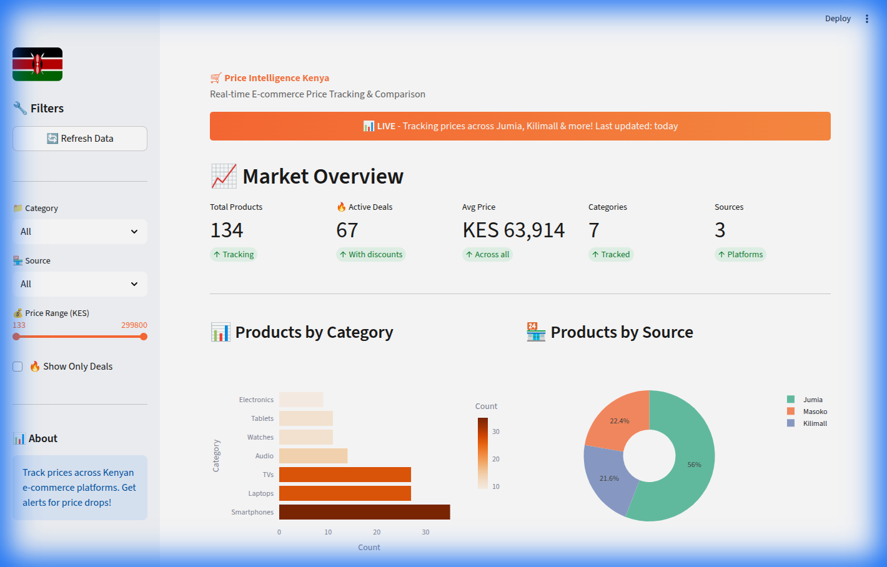
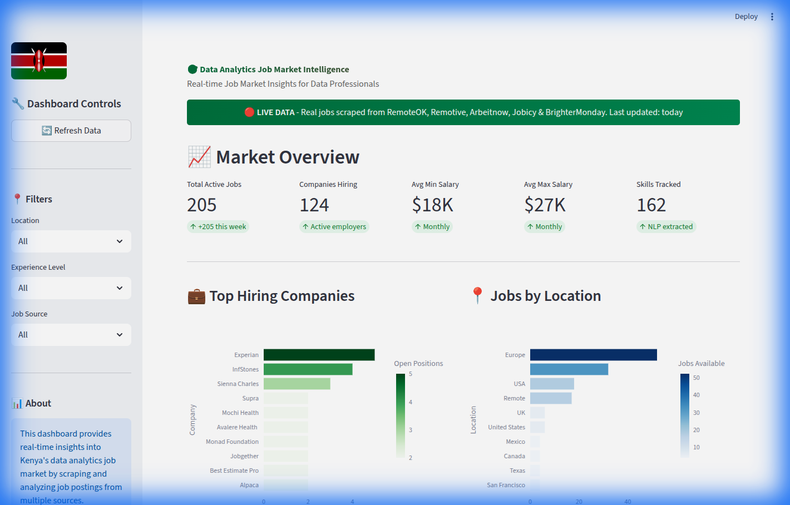

```{=html}
<div class="redesign-page redesign-page--home editorial-home">

<section class="editorial-hero reveal-on-scroll">
  <div class="editorial-hero__copy">
    <div class="editorial-hero__primary">
      <p class="editorial-hero__eyebrow">Research Data Manager · AI Systems · Data Analyst · M&amp;E</p>
      <h1 class="editorial-hero__nameplate">
        <span class="editorial-hero__given-name">
          <span class="editorial-hero__given-accent">Nic</span><span class="editorial-hero__given-rest">hodemus</span>
        </span>
        <span class="editorial-hero__surname">Amollo</span>
      </h1>
      <p class="editorial-hero__title">I help teams turn messy field data into decisions they can trust.</p>
      <p class="editorial-hero__lede">
        I work at the intersection of field research and data engineering. The work often starts with designing surveys in communities with no internet, then moves through the pipelines that clean and model what comes back. From there it becomes reports, dashboards, and decisions teams can actually use. I work best close to the people, programmes, and constraints the data is meant to serve.
      </p>
    </div>
    <div class="editorial-hero__secondary">
      <div class="editorial-hero__actions">
        <a href="projects/index.html" class="btn-solid">Selected Work</a>
        <a href="about/index.html" class="btn-ghost">My Story</a>
      </div>
      <div class="editorial-hero__ticker" aria-label="Selected capabilities">
        <div class="editorial-hero__ticker-track">
          <div class="editorial-hero__ticker-group">
            <span class="editorial-hero__ticker-chip">Research Design</span>
            <span class="editorial-hero__ticker-chip">Survey Systems</span>
            <span class="editorial-hero__ticker-chip">ODK / Kobo / REDCap</span>
            <span class="editorial-hero__ticker-chip">ETL Pipelines</span>
            <span class="editorial-hero__ticker-chip">Quality Control</span>
            <span class="editorial-hero__ticker-chip">Dashboards</span>
            <span class="editorial-hero__ticker-chip">R · Python · SQL</span>
            <span class="editorial-hero__ticker-chip">Analytics Engineering</span>
            <span class="editorial-hero__ticker-chip">AI Systems</span>
          </div>
          <div class="editorial-hero__ticker-group" aria-hidden="true">
            <span class="editorial-hero__ticker-chip">Research Design</span>
            <span class="editorial-hero__ticker-chip">Survey Systems</span>
            <span class="editorial-hero__ticker-chip">ODK / Kobo / REDCap</span>
            <span class="editorial-hero__ticker-chip">ETL Pipelines</span>
            <span class="editorial-hero__ticker-chip">Quality Control</span>
            <span class="editorial-hero__ticker-chip">Dashboards</span>
            <span class="editorial-hero__ticker-chip">R · Python · SQL</span>
            <span class="editorial-hero__ticker-chip">Analytics Engineering</span>
            <span class="editorial-hero__ticker-chip">AI Systems</span>
          </div>
        </div>
      </div>
    </div>
  </div>

  <figure class="editorial-hero__visual">
    <div class="editorial-hero__image-shell">
      
      <div class="editorial-hero__fieldnote">
        <span class="editorial-hero__fieldnote-label">Current Work</span>
        <strong>Building health financial diaries systems for 1,000+ households.</strong>
        <span>Research design, ETL, quality control, and decision support for Georgetown gui2de.</span>
      </div>
    </div>
    <div class="editorial-hero__stats" aria-label="Selected proof points">
      <div class="editorial-hero__stat">
        <span class="editorial-hero__stat-value">8+</span>
        <span class="editorial-hero__stat-label">Years</span>
      </div>
      <div class="editorial-hero__stat">
        <span class="editorial-hero__stat-value">3</span>
        <span class="editorial-hero__stat-label">Countries</span>
      </div>
      <div class="editorial-hero__stat">
        <span class="editorial-hero__stat-value">500+</span>
        <span class="editorial-hero__stat-label">Researchers trained</span>
      </div>
      <div class="editorial-hero__stat">
        <span class="editorial-hero__stat-value">6</span>
        <span class="editorial-hero__stat-label">SDG domains</span>
      </div>
    </div>
  </figure>
</section>

<section class="expertise-story section-pad section-divider reveal-on-scroll">
  <div class="section-inner">
    <p class="section-eyebrow">Expertise</p>
    <h2 class="section-h">Data, end to end.</h2>
    <p class="section-sub">From research design to dashboard delivery, the work is built for teams operating in real places with real constraints.</p>

    <div class="expertise-story__grid">
      <article class="expertise-story__card">
        <span class="expertise-story__index">01</span>
        <h3>Research &amp; M&amp;E</h3>
        <p>Designing studies, building logframes, and leading RCTs and quasi-experimental evaluations across Kenya, Uganda, and Tanzania.</p>
        <p class="expertise-story__tools">ODK · KoboToolbox · REDCap · SPSS · Stata</p>
      </article>
      <article class="expertise-story__card">
        <span class="expertise-story__index">02</span>
        <h3>Data Analytics &amp; BI</h3>
        <p>Turning messy survey exports into decisions through SQL pipelines, Power BI dashboards, and reproducible R and Python workflows.</p>
        <p class="expertise-story__tools">SQL · Power BI · R · Python · Quarto</p>
      </article>
      <article class="expertise-story__card">
        <span class="expertise-story__index">03</span>
        <h3>Full Data Lifecycle</h3>
        <p>Owning the chain from literature review and tool design through training, HFC, cleaning, analysis, reporting, and stakeholder engagement.</p>
        <p class="expertise-story__tools">XLSForm · DHIS2/KHIS · HFC · PostgreSQL · Git</p>
      </article>
    </div>
  </div>
</section>

<section class="lifecycle-atlas section-pad section-divider reveal-on-scroll">
  <div class="section-inner">
    <p class="section-eyebrow">Process</p>
    <h2 class="section-h">The full data lifecycle, owned end to end.</h2>
    <p class="section-sub">From the first community conversation to the final policy brief. Every step is structured to keep quality, speed, and trust intact.</p>

    <div class="lifecycle-atlas__grid">
      <article class="lifecycle-atlas__step" tabindex="0"><span>01</span><h3>Study Design &amp; Tools</h3><p class="lifecycle-atlas__stack">ODK · KoboToolbox · REDCap · Lit Review</p><div class="lifecycle-atlas__hover">Scoping, protocol design, IRB submissions, and tool digitization that set the foundation for high-quality data from day one.</div></article>
      <article class="lifecycle-atlas__step" tabindex="0"><span>02</span><h3>Digitalization &amp; CAPI</h3><p class="lifecycle-atlas__stack">XLSForm · DHIS2 · CommCare</p><div class="lifecycle-atlas__hover">Turning paper instruments into robust digital systems with skip logic, validation rules, and offline capability built in.</div></article>
      <article class="lifecycle-atlas__step" tabindex="0"><span>03</span><h3>Field Teams &amp; Training</h3><p class="lifecycle-atlas__stack">HFC · Supervision · QA Protocols</p><div class="lifecycle-atlas__hover">Recruiting, training, and supporting enumerators with daily HFC rhythms, debriefs, and cross-site quality checks.</div></article>
      <article class="lifecycle-atlas__step" tabindex="0"><span>04</span><h3>Data Cleaning</h3><p class="lifecycle-atlas__stack">R · Python · Stata · SPSS</p><div class="lifecycle-atlas__hover">Outlier detection, deduplication, range checks, and reproducible cleaning scripts built early rather than patched in later.</div></article>
      <article class="lifecycle-atlas__step" tabindex="0"><span>05</span><h3>Analysis &amp; Modelling</h3><p class="lifecycle-atlas__stack">SQL · Regression · DiD · ML</p><div class="lifecycle-atlas__hover">From descriptive work to mixed-methods and econometric analysis that clarifies trade-offs instead of hiding them.</div></article>
      <article class="lifecycle-atlas__step" tabindex="0"><span>06</span><h3>Reporting &amp; Dashboards</h3><p class="lifecycle-atlas__stack">Power BI · R Markdown · Quarto</p><div class="lifecycle-atlas__hover">Interactive dashboards, automated reports, and publication-ready charts that update with the work as it evolves.</div></article>
      <article class="lifecycle-atlas__step" tabindex="0"><span>07</span><h3>Stakeholder Engagement</h3><p class="lifecycle-atlas__stack">Policy Briefs · Presentations</p><div class="lifecycle-atlas__hover">Translating findings for funders, ministries, and communities through clear briefs, presentations, and learning events.</div></article>
    </div>
  </div>
</section>

<section class="portfolio-memory section-pad section-divider reveal-on-scroll">
  <div class="section-inner">
    <p class="section-eyebrow">Selected Work</p>
    <h2 class="section-h">Projects &amp; case studies.</h2>
    <p class="section-sub">Work across public health, finance, urban analytics, and analytics engineering, from field studies to decision-ready systems.</p>

    <div class="portfolio-memory__grid">
      <a href="research/thesis.html" class="portfolio-memory__card portfolio-memory__card--feature">
        <div class="portfolio-memory__media">
          
        </div>
        <div class="portfolio-memory__body">
          <p class="portfolio-memory__meta">Public Health · Published in BMC Public Health</p>
          <h3>Financing chronic care in rural Kenya</h3>
          <p>Seven-facility mixed-methods work in Seme Sub-County showing how narrow funding streams, county approval delays, and missing NCD budget lines disrupt hypertension and diabetes care.</p>
          <p class="portfolio-memory__tags">R · Mixed Methods · Published Paper</p>
          <span>Read paper →</span>
        </div>
      </a>
      <a href="projects/analytics-engineering/healthcare-readmission-risk/index.html" class="portfolio-memory__card">
        <div class="portfolio-memory__media portfolio-memory__media--compact">
          
        </div>
        <div class="portfolio-memory__body">
          <p class="portfolio-memory__meta">Analytics Engineering · Health</p>
          <h3>Healthcare readmission risk pipeline</h3>
          <p>Portfolio work that connects data preparation, modelling logic, and decision support in a clinically legible way.</p>
          <p class="portfolio-memory__tags">Python · SQL · Monitoring</p>
          <span>View →</span>
        </div>
      </a>
      <a href="projects/analytics-engineering/supply-chain-tracker/index.html" class="portfolio-memory__card">
        <div class="portfolio-memory__media portfolio-memory__media--compact portfolio-memory__media--dashboard">
          
        </div>
        <div class="portfolio-memory__body">
          <p class="portfolio-memory__meta">Operations Analytics · Urban Development</p>
          <h3>Supply chain intelligence blueprint</h3>
          <p>Logistics analytics architecture covering inventory flow, shipment reliability, and service-level monitoring for distributed operations.</p>
          <p class="portfolio-memory__tags">SQL · Forecasting · Operations</p>
          <span>Portfolio brief →</span>
        </div>
      </a>
      <a href="projects/real-estate-feasibility-studio/index.html" class="portfolio-memory__card">
        <div class="portfolio-memory__media portfolio-memory__media--compact portfolio-memory__media--dashboard">
          
        </div>
        <div class="portfolio-memory__body">
          <p class="portfolio-memory__meta">Urban Analytics · Nairobi</p>
          <h3>Nairobi real estate signals dashboard</h3>
          <p>Neighbourhood-level exploration of rent and sales patterns using trend decomposition, geospatial segmentation, and valuation signals.</p>
          <p class="portfolio-memory__tags">Geospatial · Power BI · Modelling</p>
          <span>Portfolio brief →</span>
        </div>
      </a>
      <a href="projects/ai-applications/research-brief-generator/index.html" class="portfolio-memory__card">
        <div class="portfolio-memory__media portfolio-memory__media--compact portfolio-memory__media--document">
          
        </div>
        <div class="portfolio-memory__body">
          <p class="portfolio-memory__meta">AI Applications · Research Communication</p>
          <h3>Research brief generator</h3>
          <p>An AI-assisted workflow for turning structured inputs into concise, reusable summaries without losing research structure.</p>
          <p class="portfolio-memory__tags">Python · Workflow Design · AI</p>
          <span>View →</span>
        </div>
      </a>
    </div>
  </div>
</section>

<section class="tools-trust section-pad section-divider reveal-on-scroll">
  <div class="section-inner">
    <p class="section-eyebrow">Technical Skills</p>
    <h2 class="section-h">Tools I trust.</h2>
    <p class="section-sub">Built through field work, not just coursework. Each tool here has solved a real delivery problem.</p>

    <div class="tools-trust__grid">
      <article class="tools-trust__group"><h3>Analytics &amp; Stats</h3><ul><li class="tools-trust__row tools-trust__row--expert"><span class="tools-trust__name">R</span><span class="tools-trust__meter"></span><strong>Expert</strong></li><li class="tools-trust__row tools-trust__row--advanced"><span class="tools-trust__name">Stata</span><span class="tools-trust__meter"></span><strong>Advanced</strong></li><li class="tools-trust__row tools-trust__row--proficient"><span class="tools-trust__name">Python</span><span class="tools-trust__meter"></span><strong>Proficient</strong></li><li class="tools-trust__row tools-trust__row--advanced"><span class="tools-trust__name">SPSS</span><span class="tools-trust__meter"></span><strong>Advanced</strong></li></ul></article>
      <article class="tools-trust__group"><h3>Data &amp; Databases</h3><ul><li class="tools-trust__row tools-trust__row--advanced"><span class="tools-trust__name">SQL</span><span class="tools-trust__meter"></span><strong>Advanced</strong></li><li class="tools-trust__row tools-trust__row--proficient"><span class="tools-trust__name">PostgreSQL</span><span class="tools-trust__meter"></span><strong>Proficient</strong></li><li class="tools-trust__row tools-trust__row--advanced"><span class="tools-trust__name">DHIS2/KHIS</span><span class="tools-trust__meter"></span><strong>Advanced</strong></li><li class="tools-trust__row tools-trust__row--expert"><span class="tools-trust__name">Excel</span><span class="tools-trust__meter"></span><strong>Expert</strong></li></ul></article>
      <article class="tools-trust__group"><h3>Data Collection</h3><ul><li class="tools-trust__row tools-trust__row--expert"><span class="tools-trust__name">KoboToolbox</span><span class="tools-trust__meter"></span><strong>Expert</strong></li><li class="tools-trust__row tools-trust__row--expert"><span class="tools-trust__name">ODK</span><span class="tools-trust__meter"></span><strong>Expert</strong></li><li class="tools-trust__row tools-trust__row--proficient"><span class="tools-trust__name">REDCap</span><span class="tools-trust__meter"></span><strong>Proficient</strong></li><li class="tools-trust__row tools-trust__row--proficient"><span class="tools-trust__name">CommCare</span><span class="tools-trust__meter"></span><strong>Proficient</strong></li></ul></article>
      <article class="tools-trust__group"><h3>Reporting &amp; BI</h3><ul><li class="tools-trust__row tools-trust__row--advanced"><span class="tools-trust__name">Power BI</span><span class="tools-trust__meter"></span><strong>Advanced</strong></li><li class="tools-trust__row tools-trust__row--expert"><span class="tools-trust__name">R Markdown</span><span class="tools-trust__meter"></span><strong>Expert</strong></li><li class="tools-trust__row tools-trust__row--advanced"><span class="tools-trust__name">Quarto</span><span class="tools-trust__meter"></span><strong>Advanced</strong></li><li class="tools-trust__row tools-trust__row--proficient"><span class="tools-trust__name">Tableau</span><span class="tools-trust__meter"></span><strong>Proficient</strong></li></ul></article>
    </div>
  </div>
</section>

<section class="background-ledger section-pad section-divider reveal-on-scroll">
  <div class="section-inner">
    <p class="section-eyebrow">Background</p>
    <h2 class="section-h">Where I have worked and learned.</h2>
    <p class="section-sub">A track record built through delivery, not just titles: research systems, public health analytics, cross-country fieldwork, and reporting that senior stakeholders can act on.</p>

    <div class="background-ledger__layout">
      <div class="background-ledger__column">
        <h3 class="background-ledger__heading">Experience</h3>
        <div class="background-ledger__timeline">
          <article class="background-ledger__entry"><span>2025 – Present</span><h4>Lead Research Data Manager</h4><p class="background-ledger__org">Georgetown University gui2de · Remote / Kenya</p><p>Leading data architecture for the Health Financial Diaries project across 1,000+ households, with automated dashboards for real-time policy metrics.</p></article>
          <article class="background-ledger__entry"><span>2023 – 2025</span><h4>Senior Statistician and Data Systems Lead</h4><p class="background-ledger__org">KEMRI · Nairobi and Kisumu</p><p>Built integrated health analytics pipelines and survival-analysis workflows for surveillance, decision support, and partner reporting.</p></article>
          <article class="background-ledger__entry"><span>2021 – 2023</span><h4>Senior Research Data Manager and Evaluation Lead</h4><p class="background-ledger__org">JOOUST and VLIR UOS · Kenya, Uganda, Rwanda</p><p>Coordinated cross-country datasets, supported randomized and quasi-experimental analysis, and trained teams on quality and reproducibility.</p></article>
          <article class="background-ledger__entry"><span>2017 – 2021</span><h4>Data Analyst and MEL Specialist</h4><p class="background-ledger__org">LERIS Hub · Kenya and Uganda</p><p>Designed monitoring frameworks and data-collection workflows, then delivered policy and donor reporting products for complex programmes.</p></article>
        </div>
      </div>
      <div class="background-ledger__column">
        <h3 class="background-ledger__heading">Education &amp; Certifications</h3>
        <div class="background-ledger__education">
          <article class="background-ledger__entry"><span>2022 – 2026 expected</span><h4>MSc, Epidemiology &amp; Biostatistics</h4><p class="background-ledger__org">JOOUST · Kenya</p><p>Thesis focus on financial determinants of effective hypertension and diabetes care in rural primary facilities.</p></article>
          <article class="background-ledger__entry"><span>2016</span><h4>BSc, Statistics (Honours)</h4><p class="background-ledger__org">University of Nairobi · Kenya</p><p>Second Class Upper Division.</p></article>
          <article class="background-ledger__entry"><span>Certificates</span><h4>Professional development</h4><div class="background-ledger__chips"><span>Google Data Analytics</span><span>M&amp;E in Global Health</span><span>Economic Evaluation</span><span>Biomedical Research Ethics</span><span>CITI</span><span>AWS Cloud Practitioner</span><span>Advanced R</span></div></article>
        </div>
        <div class="background-ledger__actions">
          <a href="cv/index.html" class="btn-solid">View Full CV</a>
          <a href="cv/Nichodemus_Amollo_CV.pdf" download class="btn-ghost">Download CV</a>
        </div>
      </div>
    </div>
  </div>
</section>

<section class="life-glimpse section-pad section-divider reveal-on-scroll">
  <div class="section-inner">
    <p class="section-eyebrow">Life Beyond Data</p>
    <h2 class="section-h">Field, farm &amp; people.</h2>
    <p class="section-sub">A window into the life that informs the work: communities, land, teams, and the long view behind the numbers.</p>

    <div class="life-glimpse__grid">
      <article class="life-glimpse__tile"><span>Goat Farming</span></article>
      <article class="life-glimpse__tile"><span>KESHO Conference</span></article>
      <article class="life-glimpse__tile"><span>Policy Dialogue</span></article>
      <article class="life-glimpse__tile"><span>Community &amp; Labour</span></article>
    </div>
  </div>
</section>

<section class="collab-channel section-pad section-divider reveal-on-scroll" id="contact">
  <div class="section-inner collab-channel__layout">
    <div class="collab-channel__copy">
      <p class="collab-channel__status">Channel Open</p>
      <h2 class="collab-channel__title">What if we worked together?</h2>
      <p class="collab-channel__text">
        Whether you need a research partner, an analyst embedded in your team, or someone to build the M&amp;E system from scratch, I’d like to hear from you.
      </p>
      <p class="collab-channel__note">For teams building better health systems, stronger data infrastructure, and decision-ready evidence that can survive real-world operations.</p>
      <p class="collab-channel__availability">Nairobi, Kenya. Open to remote and hybrid work, with replies usually within 48 hours.</p>
    </div>

    <div class="collab-channel__actions">
      <a href="tel:+254725737867" class="collab-channel__email">+254 725 737 867</a>
      <a href="mailto:nichodemuswerre@gmail.com" class="collab-channel__cta">Initiate Contact</a>
      <div class="collab-channel__links">
        <a href="https://github.com/gondamol" target="_blank" rel="noopener">GitHub</a>
        <a href="https://www.linkedin.com/in/nichodemusamollo/" target="_blank" rel="noopener">LinkedIn</a>
        <a href="cv/Nichodemus_Amollo_CV.pdf" download>CV</a>
      </div>
    </div>
  </div>
</section>

</div>

<script>
(function() {
  var prefersReduced = window.matchMedia('(prefers-reduced-motion: reduce)').matches;
  var revealEls = document.querySelectorAll('.reveal-on-scroll');

  if (!prefersReduced) {
    var observer = new IntersectionObserver(function(entries) {
      entries.forEach(function(entry) {
        if (entry.isIntersecting) {
          entry.target.classList.add('is-visible');
          observer.unobserve(entry.target);
        }
      });
    }, { threshold: 0.08, rootMargin: '0px 0px -32px 0px' });

    revealEls.forEach(function(el) { observer.observe(el); });
  } else {
    revealEls.forEach(function(el) { el.classList.add('is-visible'); });
  }

  var navbar = document.querySelector('.navbar');
  if (navbar) {
    window.addEventListener('scroll', function() {
      if (window.scrollY > 20) {
        navbar.classList.add('scrolled');
      } else {
        navbar.classList.remove('scrolled');
      }
    }, { passive: true });
  }
})();
</script>
```
