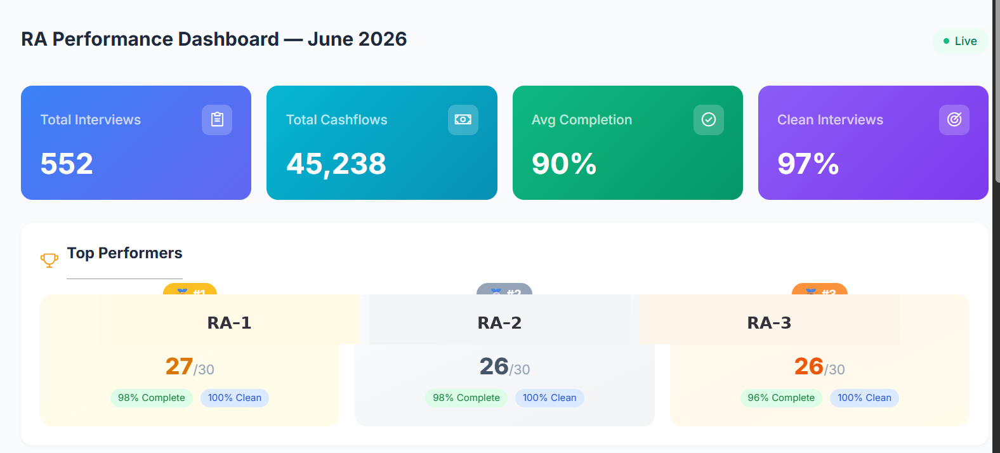
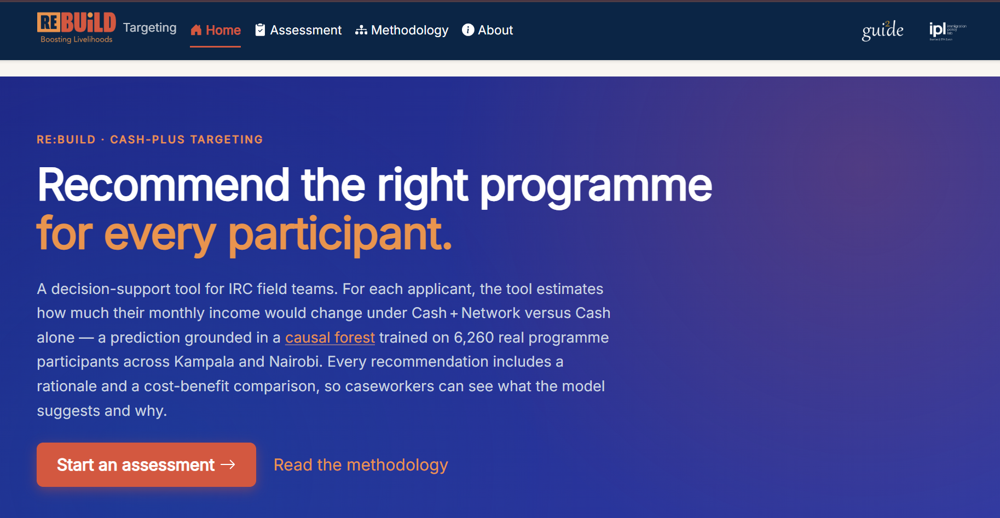

```{=html}
<div class="redesign-page redesign-page--home editorial-home">

<section class="editorial-hero reveal-on-scroll">
  <div class="editorial-hero__copy">
    <div class="editorial-hero__primary">
      <p class="editorial-hero__eyebrow">Research Data Systems · Health &amp; Development Programmes</p>
      <h1 class="editorial-hero__nameplate">
        <span class="editorial-hero__given-name">
          <span class="editorial-hero__given-accent">Nic</span><span class="editorial-hero__given-rest">hodemus</span>
        </span>
        <span class="editorial-hero__surname">Amollo</span>
      </h1>
      <p class="editorial-hero__title">I build the data systems and evidence products that make health and development programmes trustworthy.</p>
      <p class="editorial-hero__lede">
        From field instruments to policy-facing analysis: survey design in low-connectivity settings, high-frequency quality checks, pipelines that hold up under real operations, and decision tools for teams who cannot wait for a perfect spreadsheet. I work best close to the people, programmes, and constraints the data is meant to serve.
      </p>
    </div>
    <div class="editorial-hero__secondary">
      <div class="editorial-hero__actions">
        <a href="projects/index.html" class="btn-solid">Selected Work</a>
        <a href="about/index.html" class="btn-ghost">My Story</a>
      </div>
      <div class="editorial-hero__ticker" aria-label="Selected capabilities">
        <div class="editorial-hero__ticker-track">
          <div class="editorial-hero__ticker-group">
            <span class="editorial-hero__ticker-chip">Study Design</span>
            <span class="editorial-hero__ticker-chip">Survey Systems</span>
            <span class="editorial-hero__ticker-chip">ODK / Kobo / REDCap</span>
            <span class="editorial-hero__ticker-chip">HFC &amp; Quality</span>
            <span class="editorial-hero__ticker-chip">ETL Pipelines</span>
            <span class="editorial-hero__ticker-chip">Field Ops Apps</span>
            <span class="editorial-hero__ticker-chip">R · Python · SQL</span>
            <span class="editorial-hero__ticker-chip">Dashboards</span>
            <span class="editorial-hero__ticker-chip">Causal Targeting</span>
          </div>
          <div class="editorial-hero__ticker-group" aria-hidden="true">
            <span class="editorial-hero__ticker-chip">Study Design</span>
            <span class="editorial-hero__ticker-chip">Survey Systems</span>
            <span class="editorial-hero__ticker-chip">ODK / Kobo / REDCap</span>
            <span class="editorial-hero__ticker-chip">HFC &amp; Quality</span>
            <span class="editorial-hero__ticker-chip">ETL Pipelines</span>
            <span class="editorial-hero__ticker-chip">Field Ops Apps</span>
            <span class="editorial-hero__ticker-chip">R · Python · SQL</span>
            <span class="editorial-hero__ticker-chip">Dashboards</span>
            <span class="editorial-hero__ticker-chip">Causal Targeting</span>
          </div>
        </div>
      </div>
    </div>
  </div>

  <figure class="editorial-hero__visual">
    <div class="editorial-hero__image-shell">
      
      <div class="editorial-hero__fieldnote">
        <span class="editorial-hero__fieldnote-label">Current Work</span>
        <strong>Health financial diaries systems for 300 households over one year.</strong>
        <span>HFCs, automated quality workflows, and live field apps for Georgetown gui2de.</span>
      </div>
    </div>
    <div class="editorial-hero__stats" aria-label="Selected proof points">
      <div class="editorial-hero__stat">
        <span class="editorial-hero__stat-value">8+</span>
        <span class="editorial-hero__stat-label">Years</span>
      </div>
      <div class="editorial-hero__stat">
        <span class="editorial-hero__stat-value">3</span>
        <span class="editorial-hero__stat-label">Countries</span>
      </div>
      <div class="editorial-hero__stat">
        <span class="editorial-hero__stat-value">300</span>
        <span class="editorial-hero__stat-label">HH diaries (1 yr)</span>
      </div>
      <div class="editorial-hero__stat">
        <span class="editorial-hero__stat-value">7</span>
        <span class="editorial-hero__stat-label">Facilities (thesis)</span>
      </div>
    </div>
  </figure>
</section>

<section class="expertise-story section-pad section-divider reveal-on-scroll">
  <div class="section-inner">
    <p class="section-eyebrow">Expertise</p>
    <h2 class="section-h">Programme evidence, end to end.</h2>
    <p class="section-sub">Built for research and delivery teams operating under real field constraints — not classroom demos.</p>

    <div class="expertise-story__grid">
      <article class="expertise-story__card">
        <span class="expertise-story__index">01</span>
        <h3>Research data systems</h3>
        <p>Study design, digital instruments, multi-country field teams, and HFCs that catch errors while collection is still running.</p>
        <p class="expertise-story__tools">ODK · KoboToolbox · REDCap · HFC · XLSForm</p>
      </article>
      <article class="expertise-story__card">
        <span class="expertise-story__index">02</span>
        <h3>Quality architecture &amp; ops apps</h3>
        <p>Pipelines, validation layers, and live tools for supervisors — leaderboards, issue feeds, and dashboards on the study database.</p>
        <p class="expertise-story__tools">SQL · R · Python · Streamlit · Shiny</p>
      </article>
      <article class="expertise-story__card">
        <span class="expertise-story__index">03</span>
        <h3>Analysis &amp; decision products</h3>
        <p>Mixed methods, biostatistics, and evidence translation for funders, ministries, and programme leadership — including model-to-app targeting tools.</p>
        <p class="expertise-story__tools">Stata · R · Causal methods · Power BI · Quarto</p>
      </article>
    </div>
  </div>
</section>

<section class="lifecycle-atlas section-pad section-divider reveal-on-scroll">
  <div class="section-inner">
    <p class="section-eyebrow">Process</p>
    <h2 class="section-h">From field capture to a decision someone can defend.</h2>
    <p class="section-sub">Five steps. Quality, speed, and trust stay intact under real operations.</p>

    <div class="lifecycle-atlas__grid">
      <article class="lifecycle-atlas__step" tabindex="0"><span>01</span><h3>Design &amp; instruments</h3><p class="lifecycle-atlas__stack">Protocols · ODK · Kobo · REDCap</p><div class="lifecycle-atlas__hover">Scoping, tool digitization, and offline-ready CAPI that set quality before the first interview.</div></article>
      <article class="lifecycle-atlas__step" tabindex="0"><span>02</span><h3>Field teams &amp; HFC</h3><p class="lifecycle-atlas__stack">Training · Supervision · Daily QC</p><div class="lifecycle-atlas__hover">Enumerator systems, high-frequency checks, and debriefs that catch errors before they compound.</div></article>
      <article class="lifecycle-atlas__step" tabindex="0"><span>03</span><h3>Pipelines &amp; automation</h3><p class="lifecycle-atlas__stack">SQL · R · Python · Validation</p><div class="lifecycle-atlas__hover">Reproducible cleaning and quality layers so analysis does not start from a new spreadsheet firefight every cycle.</div></article>
      <article class="lifecycle-atlas__step" tabindex="0"><span>04</span><h3>Analysis &amp; models</h3><p class="lifecycle-atlas__stack">Biostats · Mixed methods · Causal</p><div class="lifecycle-atlas__hover">Descriptive through econometric and causal work that names trade-offs instead of hiding them.</div></article>
      <article class="lifecycle-atlas__step" tabindex="0"><span>05</span><h3>Products &amp; decisions</h3><p class="lifecycle-atlas__stack">Dashboards · Shiny · Briefs</p><div class="lifecycle-atlas__hover">Ops apps, policy briefs, and recommender tools that programme teams can actually use.</div></article>
    </div>
  </div>
</section>

<section class="portfolio-memory section-pad section-divider reveal-on-scroll">
  <div class="section-inner">
    <p class="section-eyebrow">Selected Work</p>
    <h2 class="section-h">Real delivery, not demos.</h2>
    <p class="section-sub">Programme data systems, field apps, and original health systems research. Methods-lab projects live under Projects when you want tooling samples.</p>

    <div class="portfolio-memory__grid">
      <a href="projects/health-financial-diaries/index.html" class="portfolio-memory__card portfolio-memory__card--feature">
        <div class="portfolio-memory__media">
          
        </div>
        <div class="portfolio-memory__body">
          <p class="portfolio-memory__meta meta-text">Field delivery · Georgetown gui2de</p>
          <h3>Health financial diaries systems</h3>
          <p>Three hundred households over one year: HFCs, automated quality workflows, an RA leaderboard, and a fuel/issues app that aggregated field problems in real time as data streamed into the study database.</p>
          <p class="portfolio-memory__tags">HFC · Streamlit · Ops dashboards · 300 HH</p>
          <span>Read case study →</span>
        </div>
      </a>
      <a href="projects/rebuild-targeting/index.html" class="portfolio-memory__card">
        <div class="portfolio-memory__media portfolio-memory__media--compact portfolio-memory__media--dashboard">
          
        </div>
        <div class="portfolio-memory__body">
          <p class="portfolio-memory__meta meta-text">Application · IRC Re:BUiLD · gui2de</p>
          <h3>Cash-plus targeting recommender</h3>
          <p>Shiny decision-support app for IRC field teams. I built the application layer from gui2de causal targeting models so caseworkers can score Cash vs Cash + Network with cost-aware rationale.</p>
          <p class="portfolio-memory__tags">Shiny · Causal forest · 6,260 participants</p>
          <span>Case study &amp; live app →</span>
        </div>
      </a>
      <a href="research/thesis.html" class="portfolio-memory__card">
        <div class="portfolio-memory__media portfolio-memory__media--compact">
          
        </div>
        <div class="portfolio-memory__body">
          <p class="portfolio-memory__meta meta-text">Research · Forthcoming BMC Public Health</p>
          <h3>Financing chronic care in rural Kenya</h3>
          <p>Seven-facility mixed-methods study on facility decision space, stockouts, and why clinics can diagnose but still fail to sustain hypertension and diabetes care.</p>
          <p class="portfolio-memory__tags">Mixed methods · Health financing · First author</p>
          <span>Read thesis →</span>
        </div>
      </a>
      <a href="posts/kisumu-cancer-dashboard/index.html" class="portfolio-memory__card">
        <div class="portfolio-memory__media portfolio-memory__media--compact">
          
        </div>
        <div class="portfolio-memory__body">
          <p class="portfolio-memory__meta meta-text">Systems · KEMRI · Oncology</p>
          <h3>Kisumu cancer surveillance dashboard</h3>
          <p>Research data management for multi-year oncology records: REDCap architecture, quality systems, survival analysis, and a county-facing dashboard launched with local leadership.</p>
          <p class="portfolio-memory__tags">REDCap · Survival analysis · Tableau</p>
          <span>Read delivery story →</span>
        </div>
      </a>
    </div>
    <p style="margin-top:1.75rem;">
      <a href="projects/index.html" class="btn-ghost">All projects →</a>
    </p>
  </div>
</section>

<section class="tools-trust section-pad section-divider reveal-on-scroll">
  <div class="section-inner">
    <p class="section-eyebrow">Technical Skills</p>
    <h2 class="section-h">Tools I trust.</h2>
    <p class="section-sub">Built through field work, not just coursework. Each tool here has solved a real delivery problem.</p>

    <div class="tools-trust__grid">
      <article class="tools-trust__group"><h3>Analytics &amp; Stats</h3><ul><li class="tools-trust__row tools-trust__row--expert"><span class="tools-trust__name">R</span><span class="tools-trust__meter"></span><strong>Expert</strong></li><li class="tools-trust__row tools-trust__row--advanced"><span class="tools-trust__name">Stata</span><span class="tools-trust__meter"></span><strong>Advanced</strong></li><li class="tools-trust__row tools-trust__row--proficient"><span class="tools-trust__name">Python</span><span class="tools-trust__meter"></span><strong>Proficient</strong></li><li class="tools-trust__row tools-trust__row--advanced"><span class="tools-trust__name">SPSS</span><span class="tools-trust__meter"></span><strong>Advanced</strong></li></ul></article>
      <article class="tools-trust__group"><h3>Data &amp; Databases</h3><ul><li class="tools-trust__row tools-trust__row--advanced"><span class="tools-trust__name">SQL</span><span class="tools-trust__meter"></span><strong>Advanced</strong></li><li class="tools-trust__row tools-trust__row--proficient"><span class="tools-trust__name">PostgreSQL</span><span class="tools-trust__meter"></span><strong>Proficient</strong></li><li class="tools-trust__row tools-trust__row--advanced"><span class="tools-trust__name">DHIS2/KHIS</span><span class="tools-trust__meter"></span><strong>Advanced</strong></li><li class="tools-trust__row tools-trust__row--expert"><span class="tools-trust__name">Excel</span><span class="tools-trust__meter"></span><strong>Expert</strong></li></ul></article>
      <article class="tools-trust__group"><h3>Data Collection</h3><ul><li class="tools-trust__row tools-trust__row--expert"><span class="tools-trust__name">KoboToolbox</span><span class="tools-trust__meter"></span><strong>Expert</strong></li><li class="tools-trust__row tools-trust__row--expert"><span class="tools-trust__name">ODK</span><span class="tools-trust__meter"></span><strong>Expert</strong></li><li class="tools-trust__row tools-trust__row--proficient"><span class="tools-trust__name">REDCap</span><span class="tools-trust__meter"></span><strong>Proficient</strong></li><li class="tools-trust__row tools-trust__row--proficient"><span class="tools-trust__name">CommCare</span><span class="tools-trust__meter"></span><strong>Proficient</strong></li></ul></article>
      <article class="tools-trust__group"><h3>Reporting &amp; BI</h3><ul><li class="tools-trust__row tools-trust__row--advanced"><span class="tools-trust__name">Power BI</span><span class="tools-trust__meter"></span><strong>Advanced</strong></li><li class="tools-trust__row tools-trust__row--expert"><span class="tools-trust__name">R Markdown</span><span class="tools-trust__meter"></span><strong>Expert</strong></li><li class="tools-trust__row tools-trust__row--advanced"><span class="tools-trust__name">Quarto</span><span class="tools-trust__meter"></span><strong>Advanced</strong></li><li class="tools-trust__row tools-trust__row--proficient"><span class="tools-trust__name">Tableau</span><span class="tools-trust__meter"></span><strong>Proficient</strong></li></ul></article>
    </div>
  </div>
</section>

<section class="background-ledger section-pad section-divider reveal-on-scroll">
  <div class="section-inner">
    <p class="section-eyebrow">Background</p>
    <h2 class="section-h">Where I have worked and learned.</h2>
    <p class="section-sub">A track record built through delivery, not just titles: research systems, public health analytics, cross-country fieldwork, and reporting that senior stakeholders can act on.</p>

    <div class="background-ledger__layout">
      <div class="background-ledger__column">
        <h3 class="background-ledger__heading">Experience</h3>
        <div class="background-ledger__timeline">
          <article class="background-ledger__entry"><span>2025 – Present</span><h4>Lead Research Data Manager</h4><p class="background-ledger__org">Georgetown University gui2de · Remote / Kenya</p><p>Health financial diaries systems for 300 households over one year (HFCs, automation, live field apps); Shiny application for Re:BUiLD cash-plus targeting with IRC partners.</p></article>
          <article class="background-ledger__entry"><span>2023 – 2025</span><h4>Senior Statistician and Data Systems Lead</h4><p class="background-ledger__org">KEMRI · Nairobi and Kisumu</p><p>Built integrated health analytics pipelines and survival-analysis workflows for surveillance, decision support, and partner reporting.</p></article>
          <article class="background-ledger__entry"><span>2021 – 2023</span><h4>Senior Research Data Manager and Evaluation Lead</h4><p class="background-ledger__org">JOOUST and VLIR UOS · Kenya, Uganda, Rwanda</p><p>Coordinated cross-country datasets, supported randomized and quasi-experimental analysis, and trained teams on quality and reproducibility.</p></article>
          <article class="background-ledger__entry"><span>2017 – 2021</span><h4>Data Analyst and MEL Specialist</h4><p class="background-ledger__org">LERIS Hub · Kenya and Uganda</p><p>Designed monitoring frameworks and data-collection workflows, then delivered policy and donor reporting products for complex programmes.</p></article>
        </div>
      </div>
      <div class="background-ledger__column">
        <h3 class="background-ledger__heading">Education &amp; Certifications</h3>
        <div class="background-ledger__education">
          <article class="background-ledger__entry"><span>2022 – 2026 expected</span><h4>MSc, Epidemiology &amp; Biostatistics</h4><p class="background-ledger__org">JOOUST · Kenya</p><p>Thesis focus on financial determinants of effective hypertension and diabetes care in rural primary facilities.</p></article>
          <article class="background-ledger__entry"><span>2016</span><h4>BSc, Statistics (Honours)</h4><p class="background-ledger__org">University of Nairobi · Kenya</p><p>Second Class Upper Division.</p></article>
          <article class="background-ledger__entry"><span>Certificates</span><h4>Professional development</h4><div class="background-ledger__chips"><span>Google Data Analytics</span><span>M&amp;E in Global Health</span><span>Economic Evaluation</span><span>Biomedical Research Ethics</span><span>CITI</span><span>AWS Cloud Practitioner</span><span>Advanced R</span></div></article>
        </div>
        <div class="background-ledger__actions">
          <a href="cv/index.html" class="btn-solid">View Full CV</a>
          <a href="cv/Nichodemus_Amollo_CV.pdf" download class="btn-ghost">Download CV</a>
        </div>
      </div>
    </div>
  </div>
</section>

<section class="life-glimpse section-pad section-divider reveal-on-scroll">
  <div class="section-inner">
    <p class="section-eyebrow">Life Beyond Data</p>
    <h2 class="section-h">Field, farm &amp; people.</h2>
    <p class="section-sub">A window into the life that informs the work: communities, land, teams, and the long view behind the numbers.</p>

    <div class="life-glimpse__grid">
      <article class="life-glimpse__tile"><span>Goat Farming</span></article>
      <article class="life-glimpse__tile"><span>KESHO Conference</span></article>
      <article class="life-glimpse__tile"><span>Policy Dialogue</span></article>
      <article class="life-glimpse__tile"><span>Community &amp; Labour</span></article>
    </div>
  </div>
</section>

<section class="collab-channel section-pad section-divider reveal-on-scroll" id="contact">
  <div class="section-inner collab-channel__layout">
    <div class="collab-channel__copy">
      <p class="collab-channel__status meta-text">Channel Open</p>
      <h2 class="collab-channel__title">What if we worked together?</h2>
      <p class="collab-channel__text">
        Whether you need a research partner, an analyst embedded in your team, or someone to build the M&amp;E system from scratch, I’d like to hear from you.
      </p>
      <p class="collab-channel__note">For teams building better health systems, stronger data infrastructure, and decision-ready evidence that can survive real-world operations.</p>
      <p class="collab-channel__availability">Nairobi, Kenya. Open to remote and hybrid work, with replies usually within 48 hours.</p>
    </div>

    <div class="collab-channel__actions">
      <a href="tel:+254725737867" class="collab-channel__email">+254 725 737 867</a>
      <a href="mailto:nichodemuswerre@gmail.com" class="collab-channel__cta">Initiate Contact</a>
      <div class="collab-channel__links">
        <a href="https://github.com/gondamol" target="_blank" rel="noopener">GitHub</a>
        <a href="https://www.linkedin.com/in/nichodemusamollo/" target="_blank" rel="noopener">LinkedIn</a>
        <a href="https://gui2de.georgetown.edu/profiles/nichodemus-amollo/" target="_blank" rel="noopener">gui2de</a>
        <a href="cv/Nichodemus_Amollo_CV.pdf" download>CV</a>
      </div>
    </div>
  </div>
</section>

</div>

<script>
(function() {
  var prefersReduced = window.matchMedia('(prefers-reduced-motion: reduce)').matches;
  var revealEls = document.querySelectorAll('.reveal-on-scroll');

  if (!prefersReduced) {
    var observer = new IntersectionObserver(function(entries) {
      entries.forEach(function(entry) {
        if (entry.isIntersecting) {
          entry.target.classList.add('is-visible');
          observer.unobserve(entry.target);
        }
      });
    }, { threshold: 0.08, rootMargin: '0px 0px -32px 0px' });

    revealEls.forEach(function(el) { observer.observe(el); });
  } else {
    revealEls.forEach(function(el) { el.classList.add('is-visible'); });
  }

  var navbar = document.querySelector('.navbar');
  if (navbar) {
    window.addEventListener('scroll', function() {
      if (window.scrollY > 20) {
        navbar.classList.add('scrolled');
      } else {
        navbar.classList.remove('scrolled');
      }
    }, { passive: true });
  }
})();
</script>
```
