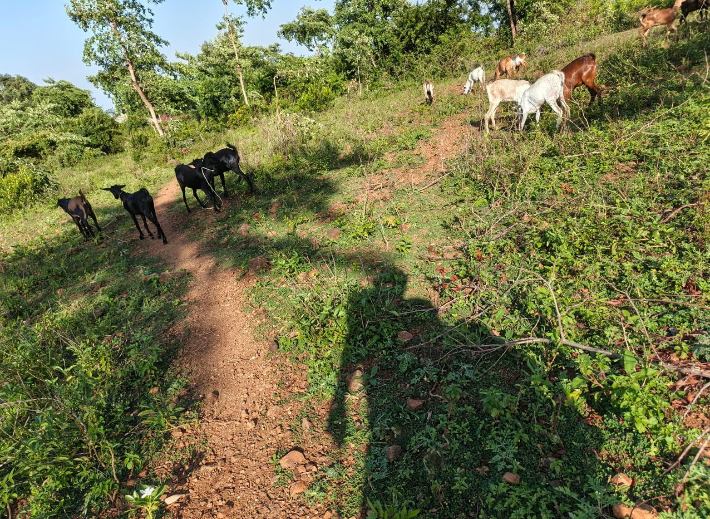
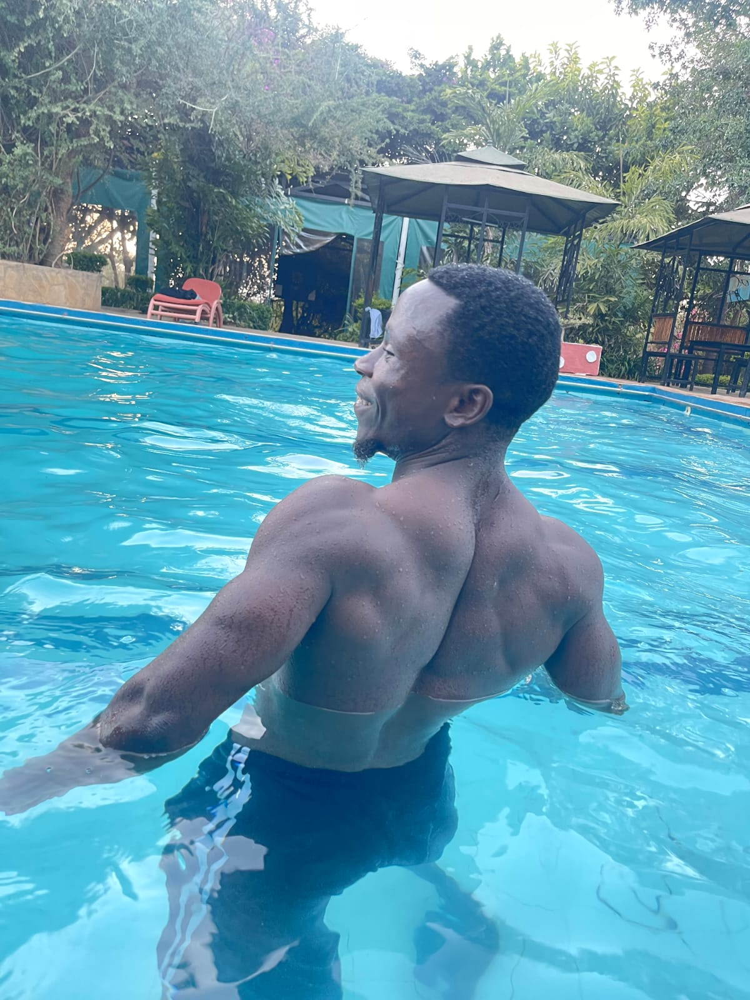

```{=html}
<div class="redesign-page">

<!-- ═══════════════════════════════════════════
     LIFE HERO
═══════════════════════════════════════════ -->
<section class="lx-hero reveal-on-scroll">
  <div class="lx-hero-inner">
    <span class="section-eyebrow">Life</span>
    <h1 class="lx-hero-heading">Beyond data,<br><em>practice and purpose.</em></h1>
    <p class="lx-hero-lead">The habits, values, and experiences that shape how I work and how I serve. Philosophy, farm life, physical discipline, and community building — each informing the other.</p>
  </div>
</section>

<!-- ═══════════════════════════════════════════
     LIFE PILLARS — Card Grid
═══════════════════════════════════════════ -->
<section class="lx-section reveal-on-scroll">
  <div class="lx-section-inner">
    <div class="lx-pillars-grid">

      <a href="#philosophy" class="lx-pillar-card">
        <div class="lx-pillar-icon">
          <svg width="32" height="32" viewBox="0 0 24 24" fill="none" stroke="currentColor" stroke-width="1.5"><path d="M2 3h6a4 4 0 0 1 4 4v14a3 3 0 0 0-3-3H2z"/><path d="M22 3h-6a4 4 0 0 0-4 4v14a3 3 0 0 1 3-3h7z"/></svg>
        </div>
        <h3>Philosophy & Spirit</h3>
        <p>Stoic practice, spiritual integration, and the daily disciplines that keep me clear and grounded.</p>
        <span class="lx-pillar-arrow">Explore ↓</span>
      </a>

      <a href="#farm" class="lx-pillar-card">
        <div class="lx-pillar-icon">
          <svg width="32" height="32" viewBox="0 0 24 24" fill="none" stroke="currentColor" stroke-width="1.5"><path d="M12 22s8-4 8-10V5l-8-3-8 3v7c0 6 8 10 8 10z"/></svg>
        </div>
        <h3>Farm & Land</h3>
        <p>Goat farming, water infrastructure, and the rural economics that keep my data analysis honest.</p>
        <span class="lx-pillar-arrow">Explore ↓</span>
      </a>

      <a href="#fitness" class="lx-pillar-card">
        <div class="lx-pillar-icon">
          <svg width="32" height="32" viewBox="0 0 24 24" fill="none" stroke="currentColor" stroke-width="1.5"><path d="M18 8h1a4 4 0 0 1 0 8h-1"/><path d="M2 8h16v9a4 4 0 0 1-4 4H6a4 4 0 0 1-4-4V8z"/><line x1="6" y1="1" x2="6" y2="4"/><line x1="10" y1="1" x2="10" y2="4"/><line x1="14" y1="1" x2="14" y2="4"/></svg>
        </div>
        <h3>Physical Discipline</h3>
        <p>Strength training, running, and movement — the practice that keeps my mind stable and focused.</p>
        <span class="lx-pillar-arrow">Explore ↓</span>
      </a>

      <a href="#community" class="lx-pillar-card">
        <div class="lx-pillar-icon">
          <svg width="32" height="32" viewBox="0 0 24 24" fill="none" stroke="currentColor" stroke-width="1.5"><path d="M17 21v-2a4 4 0 0 0-4-4H5a4 4 0 0 0-4 4v2"/><circle cx="9" cy="7" r="4"/><path d="M23 21v-2a4 4 0 0 0-3-3.87"/><path d="M16 3.13a4 4 0 0 1 0 7.75"/></svg>
        </div>
        <h3>Community & Collaboration</h3>
        <p>Multi-country coordination, mentorship, and the cross-functional partnerships that produce outcomes.</p>
        <span class="lx-pillar-arrow">Explore ↓</span>
      </a>

    </div>
  </div>
</section>

<!-- ═══════════════════════════════════════════
     QUOTE HERO
═══════════════════════════════════════════ -->
<section class="lx-quote-hero reveal-on-scroll">
  <div class="lx-quote-inner">
    <blockquote class="lx-quote-text">"He who has a <em>why</em> to live can bear almost any <em>how</em>."</blockquote>
    <cite class="lx-quote-author">— Friedrich Nietzsche</cite>
  </div>
</section>

<!-- ═══════════════════════════════════════════
     PHILOSOPHY & SPIRITUAL PRACTICE
═══════════════════════════════════════════ -->
<section class="lx-section" id="philosophy">
  <div class="lx-section-inner reveal-on-scroll">
    <span class="section-eyebrow">Philosophy</span>
    <h2 class="section-h">The inner discipline</h2>
    <p class="section-sub">I am a data professional, and I am also a person shaped by philosophy, spiritual reflection, farming, training, and community work. These practices help me stay grounded, especially when research work becomes complex.</p>

    <div class="lx-philosophy-grid">
      <article class="lx-phil-card">
        <div class="lx-phil-header">
          <svg width="24" height="24" viewBox="0 0 24 24" fill="none" stroke="currentColor" stroke-width="1.5"><circle cx="12" cy="12" r="10"/><line x1="12" y1="8" x2="12" y2="12"/><line x1="12" y1="16" x2="12.01" y2="16"/></svg>
          <h4>Stoic Discipline</h4>
        </div>
        <p>Stoic thought is part of my daily structure. It helps me stay calm, think clearly, and focus on what I can control.</p>
        <ul class="lx-practice-list">
          <li>Morning reading from <em>Meditations</em></li>
          <li>Evening reflection on choices, character, and duty</li>
          <li>Journaling around wisdom, justice, courage, and self-control</li>
        </ul>
      </article>

      <article class="lx-phil-card">
        <div class="lx-phil-header">
          <svg width="24" height="24" viewBox="0 0 24 24" fill="none" stroke="currentColor" stroke-width="1.5"><path d="M20.84 4.61a5.5 5.5 0 0 0-7.78 0L12 5.67l-1.06-1.06a5.5 5.5 0 0 0-7.78 7.78l1.06 1.06L12 21.23l7.78-7.78 1.06-1.06a5.5 5.5 0 0 0 0-7.78z"/></svg>
          <h4>Integrated Spirituality</h4>
        </div>
        <p>My spiritual life brings together multiple streams of wisdom that I see as complementary paths to integrity and inner peace.</p>
        <ul class="lx-practice-list">
          <li>Ancestral reverence — connected to identity and heritage</li>
          <li>Christian faith — compassion, service, and love</li>
          <li>Buddhist morality — mindfulness, non-attachment, ethical presence</li>
        </ul>
      </article>

      <article class="lx-phil-card lx-phil-card--reading">
        <div class="lx-phil-header">
          <svg width="24" height="24" viewBox="0 0 24 24" fill="none" stroke="currentColor" stroke-width="1.5"><path d="M2 3h6a4 4 0 0 1 4 4v14a3 3 0 0 0-3-3H2z"/><path d="M22 3h-6a4 4 0 0 0-4 4v14a3 3 0 0 1 3-3h7z"/></svg>
          <h4>Reading & Intellectual Life</h4>
        </div>
        <p>I read <em>Meditations</em> by Marcus Aurelius consistently. It keeps my mind clear during hard periods.</p>
        <div class="lx-books">
          <div class="lx-book"><strong>Marcus Aurelius</strong> <span>Stoic classics</span></div>
          <div class="lx-book"><strong>Seneca & Epictetus</strong> <span>Practical philosophy</span></div>
          <div class="lx-book"><strong>Nietzsche</strong> <span>Meaning, courage, self-creation</span></div>
          <div class="lx-book"><strong>Buddhist texts</strong> <span>Compassion, discipline, awareness</span></div>
        </div>
      </article>
    </div>
  </div>
</section>

<!-- ═══════════════════════════════════════════
     FARM LIFE — Photo gallery with context
═══════════════════════════════════════════ -->
<section class="lx-section lx-section--dark" id="farm">
  <div class="lx-section-inner reveal-on-scroll">
    <span class="section-eyebrow light">Farm & Nature</span>
    <h2 class="section-h light">Where theory meets reality</h2>
    <p class="section-sub light">The farm in Homa Bay is where analysis becomes lived experience. When I work on food systems, risk, and cash flow, I am writing from first-hand knowledge — not from distance.</p>

    <div class="gallery-grid" style="margin:2rem 0 0;">
      <div class="gal-item gal-large">
        <div class="gal-ph" style="overflow:hidden;">
          
          <div class="gal-overlay"><span class="gal-label">Water Pan — Western Kenya</span></div>
        </div>
      </div>

      <div class="gal-item gal-tall">
        <div class="gal-ph">
          
          <div class="gal-overlay"><span class="gal-label">Morning Grazing</span></div>
        </div>
      </div>

      <div class="gal-item">
        <div class="gal-ph">
          
          <div class="gal-overlay"><span class="gal-label">Herd Growth</span></div>
        </div>
      </div>

      <div class="gal-item">
        <div class="gal-ph">
          
          <div class="gal-overlay"><span class="gal-label">Infrastructure First</span></div>
        </div>
      </div>

      <div class="gal-item">
        <div class="gal-ph">
          
          <div class="gal-overlay"><span class="gal-label">New Life on the Farm</span></div>
        </div>
      </div>

      <div class="gal-item">
        <div class="gal-ph">
          
          <div class="gal-overlay"><span class="gal-label">Water & Herd Planning</span></div>
        </div>
      </div>
    </div>
  </div>
</section>

<!-- ═══════════════════════════════════════════
     PHYSICAL DISCIPLINE
═══════════════════════════════════════════ -->
<section class="lx-section" id="fitness">
  <div class="lx-section-inner reveal-on-scroll">
    <span class="section-eyebrow">Fitness</span>
    <h2 class="section-h">Physical discipline</h2>
    <p class="section-sub">Physical training keeps my mind stable and focused. I train most mornings, and I use movement to reset and think clearly.</p>

    <div class="lx-fitness-grid">
      <div class="lx-fitness-card">
        <svg width="24" height="24" viewBox="0 0 24 24" fill="none" stroke="currentColor" stroke-width="1.5"><path d="M6.5 6.5h11v11h-11z"/><path d="M2 12h4.5M17.5 12H22M12 2v4.5M12 17.5V22"/></svg>
        <h4>Strength</h4>
        <p>4–5 sessions per week</p>
      </div>
      <div class="lx-fitness-card">
        <svg width="24" height="24" viewBox="0 0 24 24" fill="none" stroke="currentColor" stroke-width="1.5"><circle cx="12" cy="12" r="10"/><polyline points="12 6 12 12 16 14"/></svg>
        <h4>Running</h4>
        <p>Active recovery days</p>
      </div>
      <div class="lx-fitness-card">
        <svg width="24" height="24" viewBox="0 0 24 24" fill="none" stroke="currentColor" stroke-width="1.5"><path d="M12 22c6-3 10-7.5 10-12v-1L12 4 2 9v1c0 4.5 4 9 10 12z"/></svg>
        <h4>Hydration</h4>
        <p>3–4 litres daily</p>
      </div>
    </div>

    <div class="gallery-grid" style="margin:2.5rem 0 0;">
      <div class="gal-item gal-large">
        <div class="gal-ph" style="overflow:hidden;">
          
          <div class="gal-overlay"><span class="gal-label">Strength Before Deep Work</span></div>
        </div>
      </div>

      <div class="gal-item">
        <div class="gal-ph">
          
          <div class="gal-overlay"><span class="gal-label">Consistency Over Intensity</span></div>
        </div>
      </div>

      <div class="gal-item">
        <div class="gal-ph">
          
          <div class="gal-overlay"><span class="gal-label">Recovery & Mobility</span></div>
        </div>
      </div>

      <div class="gal-item gal-tall">
        <div class="gal-ph">
          
          <div class="gal-overlay"><span class="gal-label">Energy & Focus</span></div>
        </div>
      </div>

      <div class="gal-item">
        <div class="gal-ph">
          
          <div class="gal-overlay"><span class="gal-label">Discipline With Community</span></div>
        </div>
      </div>
    </div>
  </div>
</section>

<!-- ═══════════════════════════════════════════
     COMMUNITY & COLLABORATION
═══════════════════════════════════════════ -->
<section class="lx-section lx-section--warm" id="community">
  <div class="lx-section-inner reveal-on-scroll">
    <span class="section-eyebrow">Community</span>
    <h2 class="section-h">The collaborative builder</h2>
    <p class="section-sub">Most of my best outcomes came from cross-functional collaboration. I value execution with people, not in isolation.</p>

    <div class="lx-collab-grid">
      <div class="lx-collab-stat">
        <span class="lx-collab-num">4</span>
        <span class="lx-collab-label">Countries coordinated</span>
        <span class="lx-collab-detail">Kenya, Uganda, Tanzania, Rwanda</span>
      </div>
      <div class="lx-collab-stat">
        <span class="lx-collab-num">500+</span>
        <span class="lx-collab-label">Researchers trained</span>
        <span class="lx-collab-detail">Analysts and enumerators</span>
      </div>
      <div class="lx-collab-stat">
        <span class="lx-collab-num">8+</span>
        <span class="lx-collab-label">Years of field leadership</span>
        <span class="lx-collab-detail">Data quality & operations</span>
      </div>
    </div>

    <div class="gallery-grid" style="margin:2.5rem 0 0;">
      <div class="gal-item gal-large">
        <div class="gal-ph" style="overflow:hidden;">
          
          <div class="gal-overlay"><span class="gal-label">Working With Research Teams</span></div>
        </div>
      </div>

      <div class="gal-item">
        <div class="gal-ph">
          
          <div class="gal-overlay"><span class="gal-label">Evidence to Public Action</span></div>
        </div>
      </div>

      <div class="gal-item">
        <div class="gal-ph">
          
          <div class="gal-overlay"><span class="gal-label">Sharing Results Clearly</span></div>
        </div>
      </div>

      <div class="gal-item">
        <div class="gal-ph">
          
          <div class="gal-overlay"><span class="gal-label">Community First Work</span></div>
        </div>
      </div>

      <div class="gal-item">
        <div class="gal-ph">
          
          <div class="gal-overlay"><span class="gal-label">Partnership in Practice</span></div>
        </div>
      </div>
    </div>
  </div>
</section>

<!-- ═══════════════════════════════════════════
     VALUES & DAILY RHYTHM
═══════════════════════════════════════════ -->
<section class="lx-section">
  <div class="lx-section-inner reveal-on-scroll">
    <span class="section-eyebrow">Values</span>
    <h2 class="section-h">What I stand for</h2>

    <div class="lx-values-grid">
      <div class="lx-value-card">
        <div class="lx-value-icon">
          <svg width="28" height="28" viewBox="0 0 24 24" fill="none" stroke="currentColor" stroke-width="1.5"><path d="M12 22s8-4 8-10V5l-8-3-8 3v7c0 6 8 10 8 10z"/></svg>
        </div>
        <h4>Integrity</h4>
        <p>Truthfulness, even when truth is uncomfortable</p>
      </div>
      <div class="lx-value-card">
        <div class="lx-value-icon">
          <svg width="28" height="28" viewBox="0 0 24 24" fill="none" stroke="currentColor" stroke-width="1.5"><path d="M20.84 4.61a5.5 5.5 0 0 0-7.78 0L12 5.67l-1.06-1.06a5.5 5.5 0 0 0-7.78 7.78l1.06 1.06L12 21.23l7.78-7.78 1.06-1.06a5.5 5.5 0 0 0 0-7.78z"/></svg>
        </div>
        <h4>Compassion</h4>
        <p>Service, especially for low-resource communities</p>
      </div>
      <div class="lx-value-card">
        <div class="lx-value-icon">
          <svg width="28" height="28" viewBox="0 0 24 24" fill="none" stroke="currentColor" stroke-width="1.5"><polygon points="13 2 3 14 12 14 11 22 21 10 12 10 13 2"/></svg>
        </div>
        <h4>Discipline</h4>
        <p>In both technical work and personal habits</p>
      </div>
      <div class="lx-value-card">
        <div class="lx-value-icon">
          <svg width="28" height="28" viewBox="0 0 24 24" fill="none" stroke="currentColor" stroke-width="1.5"><circle cx="12" cy="12" r="10"/><line x1="2" y1="12" x2="22" y2="12"/><path d="M12 2a15.3 15.3 0 0 1 4 10 15.3 15.3 0 0 1-4 10 15.3 15.3 0 0 1-4-10 15.3 15.3 0 0 1 4-10z"/></svg>
        </div>
        <h4>Civic Contribution</h4>
        <p>Open tools and evidence-led action</p>
      </div>
    </div>
  </div>
</section>

<!-- ═══════════════════════════════════════════
     DAILY RHYTHM — Timeline
═══════════════════════════════════════════ -->
<section class="lx-section lx-section--dark">
  <div class="lx-section-inner reveal-on-scroll">
    <span class="section-eyebrow light">Rhythm</span>
    <h2 class="section-h light">A day in focus</h2>

    <div class="lx-rhythm-timeline">
      <div class="lx-rhythm-step">
        <div class="lx-rhythm-marker"></div>
        <div class="lx-rhythm-content">
          <span class="lx-rhythm-time">Morning</span>
          <h4>Read, train, plan</h4>
          <p>Stoic reading, gym session, and setting the tone for the day.</p>
        </div>
      </div>
      <div class="lx-rhythm-step">
        <div class="lx-rhythm-marker"></div>
        <div class="lx-rhythm-content">
          <span class="lx-rhythm-time">Deep Work Block</span>
          <h4>Research & analysis</h4>
          <p>Coding, writing, model building, and data architecture.</p>
        </div>
      </div>
      <div class="lx-rhythm-step">
        <div class="lx-rhythm-marker"></div>
        <div class="lx-rhythm-content">
          <span class="lx-rhythm-time">Afternoon</span>
          <h4>Collaborate & learn</h4>
          <p>Meetings, field coordination, mentorship, and learning.</p>
        </div>
      </div>
      <div class="lx-rhythm-step">
        <div class="lx-rhythm-marker"></div>
        <div class="lx-rhythm-content">
          <span class="lx-rhythm-time">Evening</span>
          <h4>Reflect & reset</h4>
          <p>Reading, family time, journaling, and preparing for tomorrow.</p>
        </div>
      </div>
    </div>
  </div>
</section>

<!-- ═══════════════════════════════════════════
     CONNECT CTA
═══════════════════════════════════════════ -->
<section class="lx-section">
  <div class="lx-section-inner reveal-on-scroll">
    <div class="rx-collab-card">
      <div class="rx-collab-copy">
        <span class="section-eyebrow">Connect</span>
        <h2 class="section-h">Connect on shared values</h2>
        <p>If you care about research quality, open collaboration, practical software for Africa, or disciplined long-term work, I am open to connect.</p>
      </div>
      <div class="rx-collab-actions">
        <a href="mailto:nichodemuswerre@gmail.com" class="btn-solid">Email Me</a>
        <a href="https://github.com/gondamol" class="btn-ghost" target="_blank">GitHub ↗</a>
        <a href="https://www.linkedin.com/in/nichodemusamollo/" class="btn-ghost" target="_blank">LinkedIn ↗</a>
      </div>
    </div>
  </div>
</section>

</div>

<script>
(function() {
  var prefersReduced = window.matchMedia('(prefers-reduced-motion: reduce)').matches;
  var revealEls = document.querySelectorAll('.reveal-on-scroll');
  if (!prefersReduced) {
    var observer = new IntersectionObserver(function(entries) {
      entries.forEach(function(entry) {
        if (entry.isIntersecting) {
          entry.target.classList.add('is-visible');
          observer.unobserve(entry.target);
        }
      });
    }, { threshold: 0.06, rootMargin: '0px 0px -40px 0px' });
    revealEls.forEach(function(el) { observer.observe(el); });
  } else {
    revealEls.forEach(function(el) { el.classList.add('is-visible'); });
  }
})();
</script>
```
