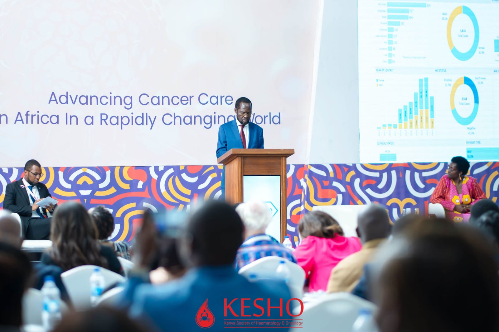
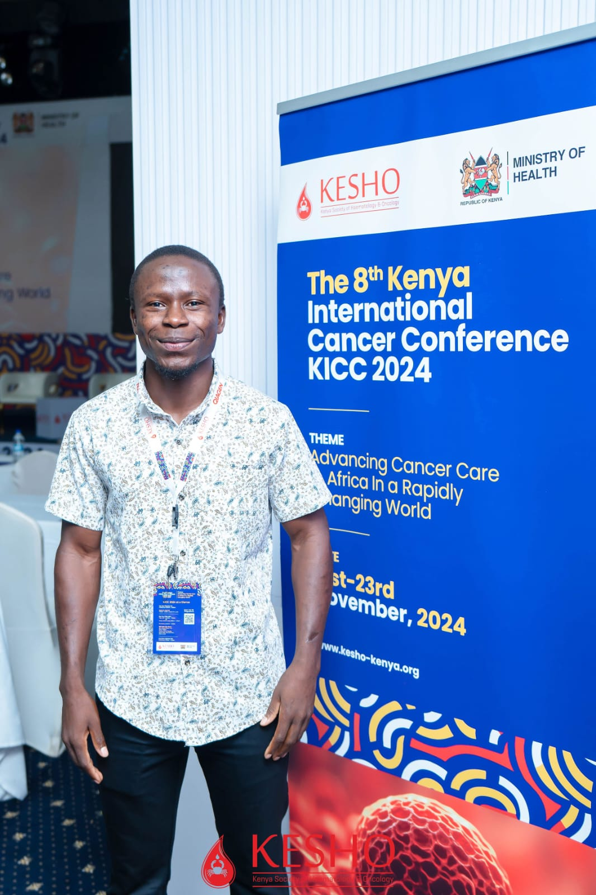
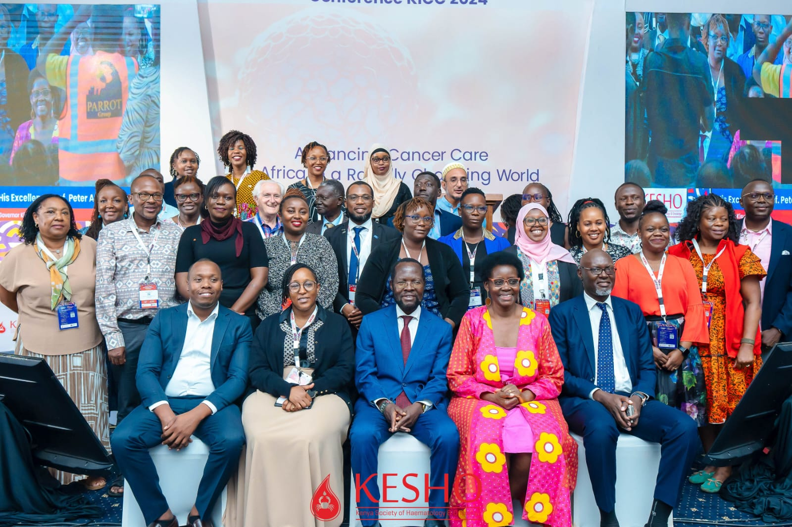

On 26 November 2024, Kisumu County leadership launched a **cancer epidemiology dashboard** built on multi-year oncology records from Jaramogi Oginga Odinga Teaching and Referral Hospital (JOOTRH). I served as **Research Data Manager** under Principal Investigator **Dr. Thomas Odeny** (Washington University in St. Louis), with KEMRI and county partners.

This note describes the data system and my role — not a product pitch.

## Why the work mattered

A retrospective review of oncology records at JOOTRH (roughly 2013–2023) made the continuity problem concrete:

- **About 59%** of patients were lost to follow-up (LTFU) within the **first year** of care  
- **5-year survival** in the analysed cohort was on the order of **9%**  
- **Thousands of patient records** (on the order of 3,400+ in the core analytic sample; later extracts grew as the registry was extended)  
- Advanced-stage presentation was common  

Those figures are clinical and operational: if patients disappear from care, treatment plans fail even when diagnosis was possible. A usable surveillance product had to sit on **trusted records**, not only on pretty charts.

## My role in the data lifecycle

I owned research data management across the pipeline. The PI and clinical partners owned clinical interpretation and programme direction; I owned instruments, quality, analysis support, and dashboard data products.

### 1. Data capture architecture (REDCap)

- Designed REDCap forms for multi-year oncology chart abstraction  
- Validation rules and branching for treatment pathways  
- Fields spanning demographics, cancer type, staging, treatments, and outcomes  

### 2. Team and protocols

- Recruited and trained research assistants in medical chart abstraction  
- Standardised extraction protocols and SOPs  
- Supervised abstraction across large volumes of paper and electronic charts  

### 3. Quality assurance

High-frequency and batch quality checks used:

- **Python** for automated validation scripts  
- **R** for statistical quality checks  
- **Stata** for consistency checks on clinical fields  

Discrepancies went back to re-abstraction. Patient confidentiality and access control were treated as non-negotiable.

### 4. Analysis support

- Survival analysis (including Kaplan–Meier approaches)  
- LTFU patterns by cancer type and stage  
- Geographic patterns (Kisumu and neighbouring counties)  
- Treatment pathway summaries for clinical and county audiences  

The first-year LTFU finding was one of the results that most clearly justified a live monitoring product.

### 5. Dashboard product (Tableau)

Built a Tableau dashboard for programme and county users covering:

- Demographics and case mix  
- Cancer type distribution  
- Stage at diagnosis  
- Treatment and follow-up signals  
- Geographic patterns  
- Survival / outcome views where data allowed  

Patient-level views were restricted and de-identified as required by the study protocol and partner rules.

## What the product was for

The dashboard was a **decision-support and surveillance surface**, not a marketing demo. Practical uses included:

- Seeing where follow-up was failing  
- Supporting outreach and re-engagement conversations  
- Making case mix and geography legible for planning  
- Giving county and facility leaders a shared evidence product  

Claims about “first in the region” are easy to overstate; what is defensible is that this was a **serious facility–county surveillance product** built on multi-year abstracted records and launched with county leadership.

## Launch and public record

The November 2024 launch included county leadership (including Governor Anyang' Nyong'o), health officials, the PI, JOOTRH cancer leadership, and clinical staff. Coverage is public:

1. [KEMRI — Innovative cancer dashboard unveiled](https://www.kemri.go.ke/innovative-cancer-dashboard-unveiled-totransform-cancer-care/)  
2. [The Standard — Kisumu launches cancer dashboard](https://www.standardmedia.co.ke/counties/article/2001506798/kisumu-launches-innovative-cancer-dashboard-to-track-cancer-patients)

## Constraints we actually hit

| Constraint | What we did |
|---|---|
| Incomplete older charts | Multi-level validation; re-abstraction for critical fields |
| Inconsistent documentation over a decade | Codebooks, SOPs, peer review of extracts |
| Connectivity and power limits | Batch workflows; offline-friendly capture habits where needed |
| Staff turnover on abstraction | Training modules and continuous supervision |

## What this demonstrates

1. End-to-end **research data management** in a clinical registry setting  
2. **HFC and multi-language QC** (Python / R / Stata) under real record quality  
3. Translation from analysis to a **county-facing product**  
4. Clear role boundary: data systems lead under a clinical PI  

## Related

- [Projects — field delivery](../../projects/index.html)  
- [Research](../../research/publications.html)  
- [CV](../../cv/index.html)
