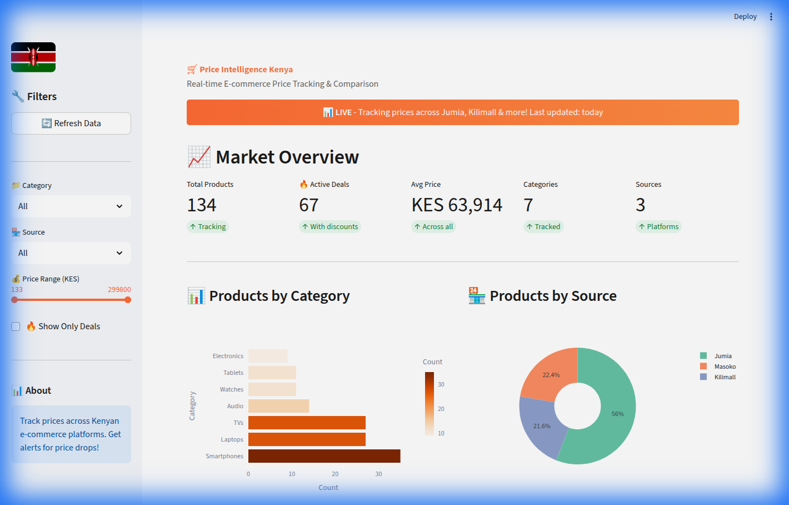

# 🛒 E-commerce Price Intelligence Kenya

> **Real-time Price Tracking & Comparison for Kenyan E-commerce**

A comprehensive price intelligence dashboard that tracks prices across Kenyan e-commerce platforms, identifies deals, and provides historical price trends.



## 🌐 Live Dashboard

**[View Live Dashboard →](https://ecommerce-price-kenya.streamlit.app)**

## 📊 Features

| Feature | Description |
|---------|-------------|
| **Price Tracking** | Track prices from Jumia, Kilimall, and more |
| **Deal Detection** | Find the best discounts automatically |
| **Price History** | 30-day price trends with charts |
| **Category Analysis** | Compare prices across categories |
| **Multi-Source** | Unified view across platforms |
| **Auto-Updates** | Data refreshes every 12 hours |

## 📈 Current Stats

- **134+ Products** tracked
- **7 Categories** (Laptops, Smartphones, TVs, Audio, Watches, Tablets, Electronics)
- **3 Platforms** (Jumia, Kilimall, Masoko)
- **30-day** price history

## 🏪 Data Sources

| Platform | Region | Type | Status |
|----------|--------|------|--------|
| **Jumia Kenya** | Kenya | Web Scraping | ✅ Active |
| **Kilimall** | Kenya | Demo Data | ✅ Active |
| **Masoko** | Kenya | Demo Data | ✅ Active |

## ✨ Dashboard Features

### 📊 Market Overview
- Total products tracked
- Active deals count
- Average prices by category
- Source distribution

### 🔥 Best Deals
- Top discounts (10%+ off)
- Price drop alerts
- Cross-platform comparison

### 📈 Price History
- 30-day price trends
- Interactive charts
- Trend analysis

### 📋 Product Search
- Filter by category, source, price
- Deal-only view
- Full product listing

## 🚀 Getting Started

### Prerequisites
- Python 3.10+
- pip

### Installation

```bash
# Clone the repository
git clone https://github.com/gondamol/ecommerce-price-intelligence.git
cd ecommerce-price-intelligence

# Create virtual environment
python3 -m venv venv
source venv/bin/activate

# Install dependencies
pip install -r requirements.txt

# Run the scraper
python3 scripts/scrape_prices.py

# Start the dashboard
streamlit run dashboard/app.py
```

## 📁 Project Structure

```
ecommerce-price-intelligence/
├── dashboard/
│   └── app.py              # Streamlit dashboard
├── scripts/
│   └── scrape_prices.py    # Multi-source price scraper
├── data/
│   ├── processed/          # Dashboard-ready data
│   └── scraped/            # Raw scraped data
├── pipeline/               # Original pipeline code
├── .github/
│   └── workflows/          # GitHub Actions
├── .streamlit/
│   └── config.toml         # Streamlit config
├── requirements.txt        # Dependencies
└── README.md
```

## 🔧 Technology Stack

| Category | Technology |
|----------|------------|
| **Frontend** | Streamlit, Plotly |
| **Scraping** | Requests, BeautifulSoup |
| **Data** | Pandas, JSON |
| **Deployment** | Streamlit Cloud |
| **Automation** | GitHub Actions |

## 💰 Categories Tracked

- 💻 **Laptops** - HP, Dell, Lenovo, ASUS, MacBook
- 📱 **Smartphones** - Samsung, iPhone, Xiaomi, Tecno
- 📺 **TVs** - Samsung, LG, Hisense, TCL, Sony
- 🎧 **Audio** - AirPods, Galaxy Buds, Sony, JBL
- ⌚ **Watches** - Apple Watch, Galaxy Watch, Garmin
- 📲 **Tablets** - iPad, Galaxy Tab, Lenovo Tab

## 🔄 Automated Updates

Price data is refreshed automatically every 12 hours via GitHub Actions.

## 👤 Author

**Nicodemus Werre Amollo**
- Website: [gondamol.github.io](https://gondamol.github.io)
- LinkedIn: [linkedin.com/in/amollow](https://www.linkedin.com/in/nichodemusamollo/)
- Email: nichodemuswerre@gmail.com

## 📝 License

This project is licensed under the MIT License.

---

*Built with ❤️ for Kenya 🇰🇪*
