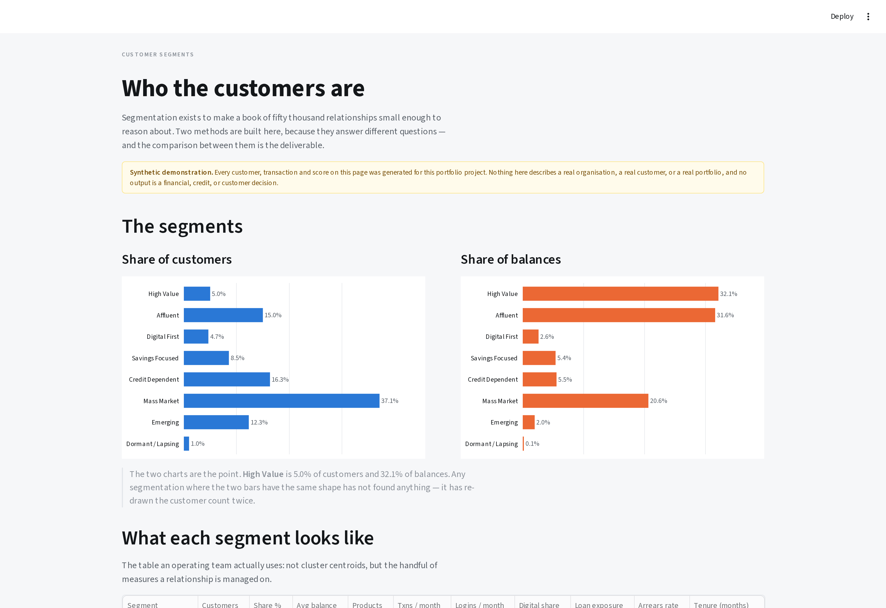

```{=html}
<div style="padding:4.5rem 0 2.25rem;">
  <span class="section-eyebrow">Methods lab · Analytics product · Synthetic data</span>
  <h1 class="section-h" style="font-size:clamp(2.2rem,4vw,3.2rem);margin-top:0.45rem;">Turning fragmented customer data into decisions someone can act on.</h1>
  <p class="section-sub" style="margin-bottom:1.6rem;">A complete analytics product built end to end: 50,000 synthetic customers, a deliberately damaged raw layer, a quality framework graded against a known answer, three predictive models, and a decision engine that stops at a suggested action with its reasoning attached — not at a chart.</p>
  <p style="margin:0;">
    <a href="https://github.com/gondamol/customer-intelligence" class="btn-primary" target="_blank" rel="noopener">Repository &amp; full documentation ↗</a>
  </p>
</div>
```

```{=html}
<div class="cv-stat-grid" style="margin-bottom:2.75rem;">
  <article class="cv-stat-card"><span class="cv-stat-num">50k</span><span class="cv-stat-label">Synthetic customers, 15-month panel</span></article>
  <article class="cv-stat-card"><span class="cv-stat-num">22</span><span class="cv-stat-label">Quality checks across 7 dimensions</span></article>
  <article class="cv-stat-card"><span class="cv-stat-num">16 / 16</span><span class="cv-stat-label">Injected defect types detected</span></article>
  <article class="cv-stat-card"><span class="cv-stat-num">6.7×</span><span class="cv-stat-label">Attrition model lift over base rate</span></article>
</div>
```

```{=html}
<figure style="margin:0 0 2.75rem;">
  
  <figcaption style="font-size:0.78rem;color:var(--muted,#6b6b6b);margin-top:0.6rem;">The executive view: four questions in order — what is happening, why, where the opportunity is, and what to consider doing.</figcaption>
</figure>
```

::: {.callout-highlight}
**Synthetic demonstration.** Every customer, transaction and score in this project was generated. Nothing here describes a real organisation, customer, or portfolio, and no output is a financial, credit, or customer decision. The methodology is transferable to any data-intensive customer environment — financial services, telecoms, insurance, retail, healthcare.
:::

## Why I built it

Most of my delivery work has been on the front half of this problem: designing instruments, building quality architecture, and getting trustworthy data out of field programmes across several countries. The back half — turning that data into a decision someone is accountable for — is where projects usually stall, and it is the part that is hardest to demonstrate from a CV line.

So I built the whole thing, and made the seams visible.

The central question is one I have met in every setting I have worked in, whether the subject was households, facilities, or customers:

> **How does an organisation turn fragmented records into an action it can defend?**

## The problem

Customer data is fragmented by construction. A ledger holds balances, a switch holds card activity, a digital channel holds logins, a contact centre holds complaints. Each is authoritative about its own domain, and none of them knows who the customer is.

The consequence is not that reporting is hard. It is that the questions worth answering cannot be asked at all:

- Which relationships are quietly ending, while the balance still looks healthy?
- Where is there genuine headroom, as opposed to a large existing balance?
- Which customers should be contacted this week, by whom, and at what cost?

## Architecture

```{=html}
<pre style="font-size:0.78rem;line-height:1.5;overflow-x:auto;background:var(--surface,#fbfaf8);border:1px solid var(--border,#e3e0d9);border-radius:6px;padding:1.1rem 1.2rem;">
                          SOURCE SYSTEMS
        ┌───────────────┬───────┴────────┬────────────────┐
        ▼               ▼                ▼                ▼
    customers       accounts        transactions      engagement
    products        balances        loans             interactions
        └───────────────┴───────┬────────┴────────────────┘
                                ▼
                          RAW LAYER            as landed, defects intact
                                │
                   22 checks · 7 dimensions
                                ▼
                       CONFORMED LAYER         every dropped row logged
                                ▼
                        MONTHLY PANEL          customer × month, full spine
                                ▼
                         CUSTOMER 360          window-parameterised
              ┌─────────────────┼─────────────────┐
              ▼                 ▼                 ▼
        SEGMENTATION       PREDICTION        OPPORTUNITY
              └─────────────────┼─────────────────┘
                                ▼
                        DECISION ENGINE        transparent, ordered rules
                                ▼
                       STREAMLIT APPLICATION   reads artefacts, computes nothing
</pre>
```

Transformations live in SQL, not in a notebook — that is where this work belongs, and where a colleague can change it. DuckDB is the default engine so the project runs on a laptop with nothing installed; the SQL avoids engine-specific syntax and runs against PostgreSQL by setting one environment variable.

## Data that behaves like data

Nothing is drawn independently. Each synthetic customer carries latent traits — affluence, digital affinity, credit appetite, relationship stability — and every observable quantity is a noisy function of those traits. The traits are never written to disk; the models see only what an analyst would see.

What follows from that structure rather than being hard-coded:

- income band rises monotonically with balances, transaction value, product holdings and digital engagement;
- digital engagement falls monotonically with age;
- customers heading for attrition show falling balances, fewer transactions, fewer logins **and** rising complaints, together;
- around a third of declines **recover**, and a further group leaves abruptly inside the outcome window.

That last point is the one that took the most iteration. My first attempt produced an attrition model scoring **0.98 ROC-AUC**, which is not a good result — it is a warning. The decline process was too deterministic, so the answer was visible in the feature window. Adding genuine recovery and genuine exogenous attrition brought it to a defensible **0.92**, and the reason it is still high is the label definition rather than the model, which is stated in the model governance document rather than left for a reader to discover.

## The finding I would lead with

```{=html}
<div class="cv-stat-grid" style="grid-template-columns:repeat(2,minmax(0,1fr));margin:2rem 0 1.25rem;">
  <article class="cv-stat-card"><span class="cv-stat-num">99.4%</span><span class="cv-stat-label">of records conform to the quality rules</span></article>
  <article class="cv-stat-card"><span class="cv-stat-num">73%</span><span class="cv-stat-label">of customers are affected by at least one defect</span></article>
</div>
```

Both figures describe exactly the same data.

Record-level conformance is a row-weighted average, and with per-rule defect rates under one percent it is arithmetically bound to sit near 100 — it will look reassuring whatever is actually wrong. But defects are not spread evenly. One damaged transaction row belongs to a customer, and most customers carry a problem somewhere in their record.

Reporting only the first number would be technically accurate and materially misleading. It is the most common failure of a data quality dashboard, and it is why both numbers sit side by side on the application's landing page.

```{=html}
<figure style="margin:1.75rem 0 2rem;">
  
  <figcaption style="font-size:0.78rem;color:var(--muted,#6b6b6b);margin-top:0.6rem;">Both figures on the page, because reporting only the reassuring one would be technically accurate and materially misleading.</figcaption>
</figure>
```

A related result: nulling 100 customer identifiers was intended to orphan 443 accounts. The checks found 697. That is not a false positive — an account whose parent lost its key is orphaned too. **Defects cascade**, which is the argument for integrity checks that run across the whole model rather than table by table.

## What the models do, and what they are not allowed to do

| Layer | Approach | Result |
|---|---|---|
| Segmentation | Published rules, checked against K-means | Silhouette **0.15** — no natural clusters exist |
| Attrition | Logistic regression | ROC-AUC **0.93**, 6.7× lift |
| Investment propensity | Logistic regression, eligible population only | ROC-AUC **0.83**, 3.8× lift |
| Lending propensity | Logistic regression, eligible population only | ROC-AUC **0.66**, 1.9× lift |
| Opportunity | Five-component published heuristic | 0–100 relative score |

Three decisions in that table are worth defending.

**The clustering result is reported as a finding, not hidden.** A silhouette of 0.15 means the customer book does not fall into naturally distinct groups — customers sit on continuous gradients. That is the argument *for* the rule-based segmentation: if the segments are a management choice either way, they should be the choice that is stable month to month and explicable to the people acting on it.

```{=html}
<figure style="margin:1.75rem 0 2rem;">
  
  <figcaption style="font-size:0.78rem;color:var(--muted,#6b6b6b);margin-top:0.6rem;">Share of customers against share of balances. High Value is 5% of the book and 32% of the balances — a segmentation where the two charts have the same shape has found nothing.</figcaption>
</figure>
```

**The weakest model is published.** Lending propensity at 0.66 is modest. It lifts the base rate by about 1.9× at the operating threshold, which is genuinely useful for ordering a finite outreach list and genuinely insufficient for anything else — and reporting it honestly is what allows that distinction to be drawn.

**Logistic regression ships, though gradient boosting scored higher.** The comparison table is published rather than hidden. A marginal gain in discrimination did not justify losing the per-customer explanation that makes a recommendation arguable.

## From prediction to action

A probability is not a decision. The decision engine is a transparent rule set rather than a model, because a recommendation has to be arguable, because the rules encode policy that should be changed deliberately, and because learning actions from historical outcomes learns the historical policy including its mistakes.

The ordering *is* the policy:

1. **Credit position** — nobody in arrears is sold anything, however attractive their scores.
2. **Unresolved service failure** — fix it before any commercial conversation.
3. **Retention** — graded by what the relationship is worth, so a relationship manager is not spent on a small at-risk account.
4. **Activation** — early-tenure customers who never established a pattern.
5. **Growth** — only on a stable relationship.
6. **Deliberately nothing** — a reachable outcome, recorded as a decision.

Every recommendation carries the rule that fired, the model reasons beneath it, the constraint on acting, and a confidence grade based on **how much history exists** — not on how extreme the score is. A decisive-looking score on three months of thin activity is the case to treat most carefully, not least.

```{=html}
<figure style="margin:1.75rem 0 2.25rem;">
  
  <figcaption style="font-size:0.78rem;color:var(--muted,#6b6b6b);margin-top:0.6rem;">One customer: the evidence, which rule fired, why the action follows, the constraint on acting, and how much confidence the history supports.</figcaption>
</figure>
```

## Governance as code, not as an appendix

- **Leakage.** Training features come from months 1–12 with the outcome in 13–15; scoring features from months 4–15 with the outcome unobserved. Both are produced by the *same SQL file* with a different window, so the two definitions cannot drift apart. A test greps the SQL for any month literal reaching into the outcome window.
- **Protected attributes.** Gender is in the source data and shown in the customer profile, because a real extract would contain it. It is **not** an input to any model, and a test fails the build if that changes. "It was in the data" is not a reason to let a targeting model condition on it.
- **Eligibility.** Each model scores only the population it could have been trained on. Ineligible customers get null, not zero — zero is a prediction, null is an admission.
- **Data minimisation.** No names, addresses, contact details or identifiers are ever generated. A test enforces it.
- **Nothing dropped silently.** Every removed row is counted with the rule and the reasoning.

## How this connects to what I already do

The techniques here are not a departure from my delivery work; they are the same discipline pointed at a different subject.

| In this project | In work I have delivered |
|---|---|
| Quality checks graded against injected defects | High-frequency checks and automated quality workflows on the health financial diaries study |
| Conformance log — nothing dropped silently | Data quality architecture for multi-year oncology records |
| Decision engine with stated guardrails | Shiny decision-support for IRC field teams, from causal forest targeting models |
| Customer 360 from seven source tables | Research data management across multi-country programme systems |
| An application that reads artefacts | Real-time field dashboards and operational apps |
| Statistical rigour as the guardrail | Mixed-methods research and survival analysis |

The progression I am demonstrating:

```
Data management → Analytics → Statistical modelling → Decision support → Analytics products
```

## Limitations

A demonstration that hides its boundaries is worth less than one that names them.

The data is synthetic and generated from a known process, so relationships are cleaner than reality — there are no seasonal effects, no macroeconomic shocks, no mid-panel migrations. Performance figures are a property of that process and are not a forecast for a real portfolio. The attrition label is *behavioural* ("went quiet") rather than commercial ("closed the account"), which is the main reason the reported AUC is high — it is the label that is easy, not the model that is exceptional. Fifteen months is too short a panel to have learned anything seasonal. The opportunity score is a stated heuristic, not a fitted model. And no causal claim is supported anywhere: permutation importance measures what a model relies on, not what causes attrition.

## Running it

```bash
git clone https://github.com/gondamol/customer-intelligence.git
cd customer-intelligence

make setup      # create the environment
make all        # generate, assess quality, build, model and score
make run        # open the application
```

`make all` takes about seven minutes on 50,000 customers; `make demo` runs the same pipeline on 8,000 for a quicker look. Seven test suites cover schema and referential integrity, the quality framework, leakage controls, feature generation, model behaviour, the decision rules, and the SQL layer.

```{=html}
<div style="margin:2.5rem 0 1rem;">
  <a href="https://github.com/gondamol/customer-intelligence" class="btn-primary" target="_blank" rel="noopener">Repository &amp; documentation ↗</a>
  <a href="../index.html" class="btn-ghost">All projects</a>
</div>
```

::: {.callout-highlight}
**The domain may change. The analytical problem remains: turning complex data into better decisions.**
:::
