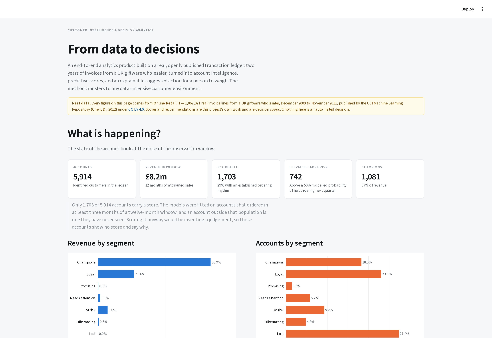
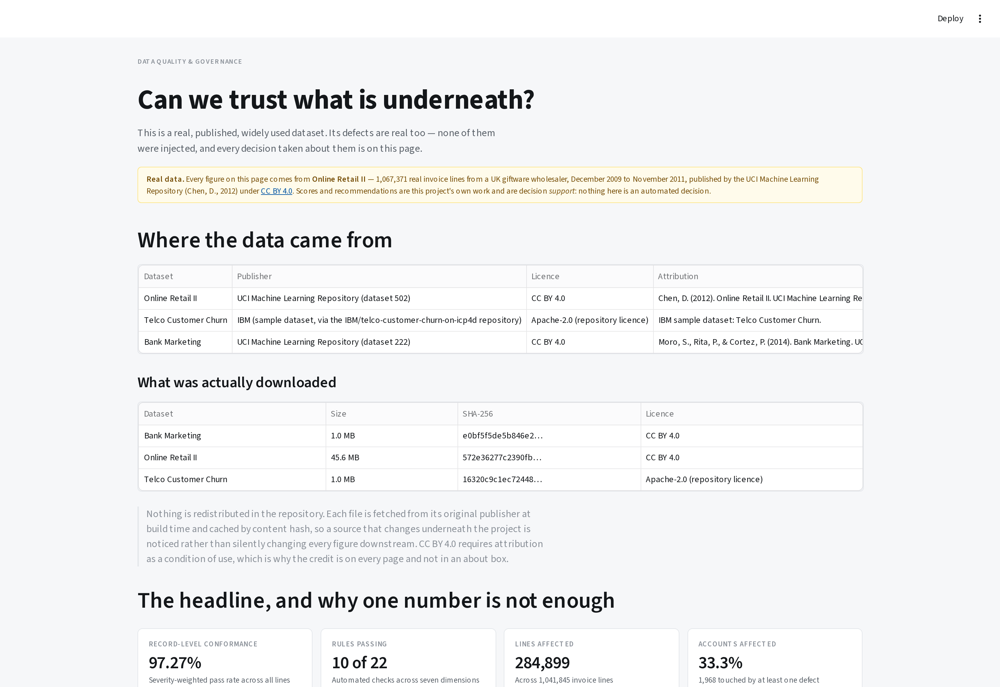

```{=html}
<div style="padding:4.5rem 0 2.25rem;">
  <span class="section-eyebrow">Analytics product · Real open data</span>
  <h1 class="section-h" style="font-size:clamp(2.2rem,4vw,3.2rem);margin-top:0.45rem;">Turning a messy transaction ledger into decisions someone can act on.</h1>
  <p class="section-sub" style="margin-bottom:1.6rem;">Two years of real invoices from a UK giftware wholesaler — 1,067,371 lines, published by the UCI Machine Learning Repository — turned into account intelligence, calibrated predictive scores, and an explainable suggested action. Built end to end: acquisition, quality, analytical model, models, decision engine, and a deployable application.</p>
  <p style="margin:0;">
    <a href="https://github.com/gondamol/customer-intelligence" class="btn-primary" target="_blank" rel="noopener">Repository &amp; documentation ↗</a>
  </p>
</div>
```

```{=html}
<div class="cv-stat-grid" style="margin-bottom:2.75rem;">
  <article class="cv-stat-card"><span class="cv-stat-num">1.07m</span><span class="cv-stat-label">Real invoice lines, 24-month panel</span></article>
  <article class="cv-stat-card"><span class="cv-stat-num">22.6%</span><span class="cv-stat-label">Of the ledger belongs to no customer</span></article>
  <article class="cv-stat-card"><span class="cv-stat-num">0.735</span><span class="cv-stat-label">Cross-validated ROC-AUC, lapse model</span></article>
  <article class="cv-stat-card"><span class="cv-stat-num">1.49×</span><span class="cv-stat-label">Recommender lift over popularity</span></article>
</div>
```

```{=html}
<figure style="margin:0 0 2.75rem;">
  
  <figcaption style="font-size:0.78rem;color:var(--muted,#6b6b6b);margin-top:0.6rem;">The executive view: what is happening, why, where the opportunity is, and what to consider doing. Champions are 18.3% of accounts and 66.9% of revenue.</figcaption>
</figure>
```

::: {.callout-highlight}
**Data:** [Online Retail II](https://archive.ics.uci.edu/dataset/502/online+retail+ii) — Chen, D. (2012), UCI Machine Learning Repository, used under [CC BY 4.0](https://creativecommons.org/licenses/by/4.0/). Scores and recommendations are my own work and are decision **support**: nothing in the system is an automated decision.
:::

## Why I rebuilt this on real data

I first built this on data I generated myself. It looked good — the attrition model scored **0.93** — and that was the problem. A model that good on invented data is measuring how knowable the invention was.

So I sourced open, properly licensed transaction data and rebuilt on it. The architecture did not change. What the numbers mean did.

| | Synthetic version | On real data |
|---|---|---|
| Attrition model | ROC-AUC 0.93 | **0.735 ± 0.035** |
| Data quality defects | 16 types, injected by me | Real, and worse |
| Unattributable revenue | none | **22.6% of the ledger** |
| Seasonality | none | 3× between February and November |

The lower number is the honest one, and every awkward property below is something the invented data simply did not have.

## The data engineering is the substance

The source is one flat sheet of invoice lines. Almost everything interesting about it is a problem:

- **`Invoice` and `StockCode` mix integers with alphanumeric codes.** Read as numbers — which is what a naive load does — every credit note and administrative row silently disappears.
- **0.57% of stock codes are not products at all**: postage, carriage, manual adjustments, discounts, samples, bank charges, an **Amazon commission of −£260,764**, bad-debt write-offs, gift vouchers, and seventeen rows described as *"This is a test product"*.
- **`M` and `m` are the same manual-adjustment code**, entered two ways. Unified — but for administrative codes only, because product codes are case-significant: `84031A` and `84031B` are different items.
- **22,950 negative quantities.** Returns are *separated*, not netted off. Netting makes an account that buys £10,000 and returns £9,000 identical to one that buys £1,000 and returns nothing.
- **243,007 lines carry no customer identifier.** Real revenue that belongs to nobody. It stays in the revenue totals and is excluded from every account-level figure — and the site says so, because that is the difference between a measurement and a claim.
- **5,305 stock codes and no categories.** A derived keyword taxonomy carries 87.7% of revenue into eleven named categories. A published judgement, not a fact about the data.

## The decision that mattered most was a window, not a model

This business takes **84,711 invoice lines in November 2011 and 27,707 in February**. That single fact determined the experimental design:

```{=html}
<pre style="font-size:0.8rem;line-height:1.6;overflow-x:auto;background:var(--surface,#fbfaf8);border:1px solid var(--border,#e3e0d9);border-radius:6px;padding:1.1rem 1.2rem;">
train   features months  1–12  (Dec 09 – Nov 10) → outcome 13–15  (Dec 10 – Feb 11)
score   features months 13–24  (Dec 10 – Nov 11) → outcome 25–27  (Dec 11 – Feb 12, unobserved)
</pre>
```

Both feature windows are twelve whole months, so seasonality averages out inside them. **Both outcome windows are December–February**, so the model is applied to the season it was trained on. A test enforces it.

The same reasoning fixed the growth model. The obvious target — "beats its own annual quarterly run-rate" — is wrong in a seasonal business: in a low quarter most accounts fall below their annual average whatever they do, and the model spends its capacity learning the calendar. Comparing **the same quarter a year earlier** moved ROC-AUC from **0.62 to 0.68** on identical features.

## What the models do

| Model | Question | Result |
|---|---|---|
| **Lapse risk** | Will an established account place no order next quarter? | Cross-validated ROC-AUC **0.735 ± 0.035**, lift 1.70× |
| **Growth propensity** | Will it beat the same quarter a year earlier? | Cross-validated ROC-AUC **0.680 ± 0.033**, lift 1.66× |
| **Next best product** | What should we lead with? | hit@5 **0.314** vs 0.211 popularity — **1.49× lift** |

Both classifiers are quoted **cross-validated with a spread**, not on a single held-out split. Re-running the project with the rows in a different order moved a held-out AUC by 0.05 — about two standard errors on this sample, and enough to report as an improvement something that is only a different shuffle. The single split flattered both models by 0.03–0.04, in the same direction.

Both are calibrated in the large to three decimal places: predicted 0.453 against observed 0.454, and 0.240 against 0.240.

### Two negative results, published

A **category-expansion classifier** scored ROC-AUC **0.550** — barely above chance. A **category-level recommender** then failed to beat a popularity baseline (0.927 against 0.936).

Both failed for the same structural reason, and finding it mattered more than either model would have: **the median account already buys 9 of the 12 categories**. "The top three you don't buy" is most of what is left, so there is almost nothing to predict.

Reframed to **product** level — 400 products, median account buys 18 — the problem is real, and item-to-item collaborative filtering beats popularity by 1.49× at k=5. It can also name the product an account manager should lead with, which a propensity score never could.

The answer was to change the question, not to reach for a bigger model.

```{=html}
<figure style="margin:1.75rem 0 2rem;">
  
  <figcaption style="font-size:0.78rem;color:var(--muted,#6b6b6b);margin-top:0.6rem;">One account: the evidence, which rule fired, the product to lead with, the constraint on acting, and how much confidence the trading history supports.</figcaption>
</figure>
```

## From prediction to action

A probability is not a decision. The decision engine is a transparent ordered rule set rather than a model — a recommendation has to be arguable by the account manager who receives it, the rules encode commercial policy that should change deliberately, and learning actions from last year learns last year's policy including its mistakes.

The ordering *is* the policy:

1. **Service failure** — a 20%+ return rate is not a sales opportunity.
2. **Too new to judge** — onboarding, not a low-value label.
3. **Not scored** — says so, rather than implying a judgement never made.
4. **Retention** — graded by what the account is worth and how far past its own usual gap it has drifted.
5. **Growth** — only on an account that is not going anywhere.
6. **Deliberately nothing** — a reachable outcome, recorded as a decision.

**15% of accounts reach a named account manager, and they hold 48% of revenue.** An engine routing much more than that to human contact has produced a wish list rather than a plan, so the check sits on the page.

### The accounts the models refuse to score

Only **1,703 of 5,914** accounts have an established ordering rhythm. The rest carry no score, sit in a **"Not scored"** quadrant, and their recommendation says why.

That was a bug I had to fix. Filling their risk with 1.0 to make the arithmetic work put them in the *Retain* quadrant — flagged as high-risk on the strength of a number the model had explicitly declined to produce. Enforcing eligibility at scoring time as well as training time cut the account-manager workload from 45% of the book to 15%.

## The data quality section is real now

```{=html}
<div class="cv-stat-grid" style="grid-template-columns:repeat(2,minmax(0,1fr));margin:2rem 0 1.25rem;">
  <article class="cv-stat-card"><span class="cv-stat-num">97.3%</span><span class="cv-stat-label">of records conform to the quality rules</span></article>
  <article class="cv-stat-card"><span class="cv-stat-num">22.6%</span><span class="cv-stat-label">of the ledger belongs to no customer at all</span></article>
</div>
```

Both figures describe the same data. Conformance is a row-weighted average and at these defect rates it is arithmetically bound to look reassuring — it is the wrong number to lead with. The one that changes what the analysis can *claim* is the second.

Twenty-two rules across seven dimensions found 235,143 unattributable lines, 34,058 exact duplicates, 3,427 negative quantities on invoices that are not credit notes, 1,215 stock codes carrying conflicting descriptions, and seventeen test rows in production data. None of it was injected.

### How do I know the checks work?

On real data the answer is not known in advance, so the checks cannot be graded against it. So they are graded elsewhere: the synthetic generator from the first version of this project is retained as a **validation harness**. It injects sixteen defect types in known quantities, and the reconciliation of injected against detected is a test the build must pass. The complementary test matters as much — the same rules run over the *undamaged* data must all pass, or a check that always fires would look like a working detector.

Prove the instrument reads correctly against a known answer, then point it at data where the answer is unknown.

```{=html}
<figure style="margin:1.75rem 0 2rem;">
  
  <figcaption style="font-size:0.78rem;color:var(--muted,#6b6b6b);margin-top:0.6rem;">Provenance, licence, and what is actually wrong with a widely used published dataset.</figcaption>
</figure>
```

## Governance as code

- **Attribution.** CC BY 4.0 makes credit a condition of use, not a courtesy. The source, publisher, licence and citation are carried in code and shown on every page.
- **Provenance.** Each file is downloaded from its original publisher at build time and cached by SHA-256. A source that changes upstream is reported rather than silently changing every figure downstream.
- **Leakage.** Training and scoring features come from the *same SQL file* with a different window. A test greps the SQL for any month literal reaching into the outcome window.
- **Eligibility.** Models refuse to score outside the population they were fitted on. Ineligible accounts get null, not zero — zero is a prediction, null is an admission.
- **Nothing dropped silently.** Every removed line is counted with the rule and the reasoning, including the 235,143 that belong to nobody.

## How this connects to what I already do

The techniques are the same discipline pointed at a different subject.

| In this project | In work I have delivered |
|---|---|
| Quality rules graded against a known answer | High-frequency checks and automated quality workflows on the health financial diaries study |
| Conformance log — nothing dropped silently | Data quality architecture for multi-year oncology records |
| Decision engine with stated guardrails | Shiny decision-support for IRC field teams, from causal forest targeting models |
| Account 360 from a flat ledger | Research data management across multi-country programme systems |
| An application that reads artefacts | Real-time field dashboards and operational apps |
| Cross-validated estimates with spreads | Mixed-methods research and survival analysis |

```
Data management → Analytics → Statistical modelling → Decision support → Analytics products
```

## Limitations

One business, two years, one country of origin — a UK giftware wholesaler selling largely to trade customers, so nothing generalises without re-fitting. The lapse label is *behavioural*, not contractual: a wholesale customer cannot cancel, only stop ordering. 22.6% of the ledger is unattributable, so every per-account figure describes the 77% that can be attributed. The product taxonomy is derived by keyword rules — a published judgement covering 87.7% of revenue. 1,752 accounts train the lapse model, which is small and is why the reported spreads are what they are. Two years is two Christmases: enough to align the windows seasonally, not enough to model seasonality itself. And no causal claim is supported anywhere — permutation importance measures what a model relies on, not what causes an account to lapse.

## Running it

```bash
git clone https://github.com/gondamol/customer-intelligence.git
cd customer-intelligence

make setup      # create the environment
make run        # open the application — derived artefacts are committed
make all        # or rebuild everything from the published source
```

The application starts immediately: the artefacts it reads are in the repository, so there is no build step and no data download at start-up. `make all` re-fetches Online Retail II from UCI and rebuilds the whole pipeline. 123 tests cover the source adapter, the conformed layer, seasonal window alignment, leakage controls, model behaviour, the decision rules and the recommender.

```{=html}
<div style="margin:2.5rem 0 1rem;">
  <a href="https://github.com/gondamol/customer-intelligence" class="btn-primary" target="_blank" rel="noopener">Repository &amp; documentation ↗</a>
  <a href="../index.html" class="btn-ghost">All projects</a>
</div>
```

::: {.callout-highlight}
**The domain may change. The analytical problem remains: turning complex data into better decisions.**
:::
