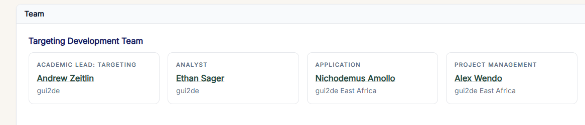
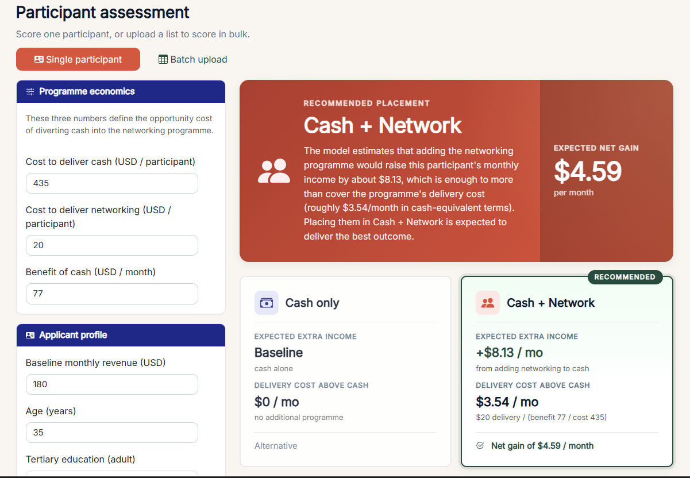

```{=html}
<div style="padding:4.5rem 0 1.5rem;">
  <span class="section-eyebrow">Application development · Georgetown gui2de · IRC Re:BUiLD</span>
  <h1 class="section-h" style="font-size:clamp(2.2rem,4vw,3.2rem);margin-top:0.45rem;">From targeting models to a field recommender.</h1>
  <p class="section-sub" style="margin-bottom:1.25rem;">
    I built the Shiny application that turns gui2de cash-plus targeting analysis into a decision-support tool for IRC caseworkers: score one applicant or a batch, compare Cash only versus Cash + Network, and see a plain-language rationale with cost-aware economics.
  </p>
  <div style="display:flex;flex-wrap:wrap;gap:0.75rem;margin-bottom:0.5rem;">
    <a href="https://rebuild.shinyapps.io/rebuild-targeting/" class="btn-solid" target="_blank" rel="noopener">Open live app →</a>
    <a href="https://gui2de.georgetown.edu/profiles/nichodemus-amollo/" class="btn-ghost" target="_blank" rel="noopener">gui2de profile →</a>
    <a href="https://gui2de.georgetown.edu/our-work/refugees/rebuild/" class="btn-ghost" target="_blank" rel="noopener">gui2de Re:BUiLD page →</a>
  </div>
</div>
```

```{=html}
<div class="cv-stat-grid" style="margin-bottom:2.5rem;">
  <article class="cv-stat-card"><span class="cv-stat-num">6,260</span><span class="cv-stat-label">Programme participants in the training sample</span></article>
  <article class="cv-stat-card"><span class="cv-stat-num">2</span><span class="cv-stat-label">Cities — Kampala and Nairobi</span></article>
  <article class="cv-stat-card"><span class="cv-stat-num">16</span><span class="cv-stat-label">Applicant features in the parsimonious model</span></article>
  <article class="cv-stat-card"><span class="cv-stat-num">App</span><span class="cv-stat-label">Named Application role on the product</span></article>
</div>
```

## My role (accurate credit)

On the product’s Targeting Development Team I am listed as **Application** (gui2de East Africa): I developed the Shiny recommender from the targeting models so field teams could use the analysis operationally.

| Role | Person | Unit |
|---|---|---|
| Academic lead: targeting | Andrew Zeitlin | gui2de |
| Analyst | Ethan Sager | gui2de |
| **Application** | **Nichodemus Amollo** | **gui2de East Africa** |
| Project management | Alex Wendo | gui2de East Africa |

I do not claim sole ownership of the causal forest or the working-paper analysis. I claim the **application layer**: assessment UX, economics inputs, recommendation presentation, batch workflow, and deployment of a tool caseworkers can run.

```{=html}
<figure style="margin:1.5rem 0 2rem;border:1px solid var(--border);background:#fff;padding:0.75rem;max-width:720px;">
  
  <figcaption style="font-size:0.85rem;color:var(--muted);padding:0.75rem 0.25rem 0.25rem;">
    On-product team credit — Application: Nichodemus Amollo, gui2de East Africa.
  </figcaption>
</figure>
```

## Programme context

**Re:BUiLD** (Refugees in East Africa: Boosting Urban Innovations for Livelihoods Development) is a multi-year initiative led by the **International Rescue Committee** with support from the **IKEA Foundation**, pairing livelihoods services for refugee and host-community residents of Kampala and Nairobi with rigorous evidence generation. Georgetown **gui2de** supports the research and evidence layer.

Live tool: [rebuild.shinyapps.io/rebuild-targeting](https://rebuild.shinyapps.io/rebuild-targeting/){target="_blank"}

## Problem the app solves

Average treatment effects hide real heterogeneity: networking helps some participants much more than others, and networking is more expensive to deliver than cash. Field teams need a **participant-specific, cost-aware recommendation** that still leaves the final call with the caseworker.

## What the recommender does

1. **Enter a profile** — screening characteristics (e.g. age, baseline monthly revenue, refugee status, language fluency, and related fields).  
2. **See the prediction** — estimated change in monthly income if networking is added to cash, weighed against delivery cost.  
3. **Review with judgement** — clear **Cash only** or **Cash + Network** recommendation with rationale and cost-benefit comparison.  

Also supports **batch upload** so programmes can score a list of applicants, not only one-by-one.

```{=html}
<figure style="margin:1.5rem 0 2rem;border:1px solid var(--border);background:#fff;padding:0.75rem;">
  
  <figcaption style="font-size:0.85rem;color:var(--muted);padding:0.75rem 0.25rem 0.25rem;">
    Product home: decision support for IRC field teams, grounded in a causal forest trained on 6,260 real programme participants.
  </figcaption>
</figure>
```

## Methods spine (for technical readers)

- **Model family:** causal forest (Wager & Athey; `grf` in R)  
- **Estimand:** conditional average treatment effect (CATE) of Cash + Network versus Cash only  
- **Training sample:** 6,260 Wave 2 programme participants across Uganda and Kenya (Kampala and Nairobi)  
- **Decision rule (app logic):** compare CATE to an opportunity-cost expression built from programme economics (cost of cash, cost of networking, benefit of cash)  
- **UX requirement:** every recommendation needs a **rationale** and a **cost-benefit comparison**, not only a score  

```{=html}
<figure style="margin:1.5rem 0 2rem;border:1px solid var(--border);background:#fff;padding:0.75rem;">
  
  <figcaption style="font-size:0.85rem;color:var(--muted);padding:0.75rem 0.25rem 0.25rem;">
    Assessment UI: programme economics and applicant profile on the left; recommended placement, expected extra income, and net gain on the right.
  </figcaption>
</figure>
```

## Caveats the product is honest about

- Recommendations are **advisory**; caseworkers keep final judgement  
- Model fit is specific to the training contexts and waves; do not casually extrapolate to new countries without re-training  
- Cross-site transport of targeting rules is a research concern, not something the app pretends is solved  
- Use non-identifying participant IDs unless the deployment environment is approved for identifiable data  

## What this demonstrates

1. Turning **research models into field software** under partner branding and real users  
2. Clear **role boundaries** (application vs academic lead vs analyst)  
3. Cost-aware causal targeting presented in language caseworkers can use  
4. Deployment discipline (Shiny, methodology tab, batch + single assessment paths)  

## Links

- [Live Re:BUiLD targeting app](https://rebuild.shinyapps.io/rebuild-targeting/){target="_blank"}  
- [gui2de profile — Nichodemus Amollo](https://gui2de.georgetown.edu/profiles/nichodemus-amollo/){target="_blank"}  
- [gui2de Re:BUiLD research page](https://gui2de.georgetown.edu/our-work/refugees/rebuild/){target="_blank"}  
- [Back to Projects](../index.html)

[Get in touch →](mailto:nichodemuswerre@gmail.com){.btn-solid style="margin-top:1.5rem;display:inline-block;"}
